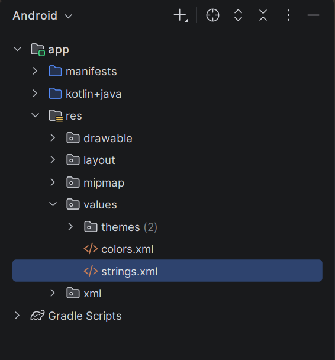

<div style="font-family: Times New Roman; font-size: 14pt; line-height: 1.5;">

<div style="text-align: center">

**МИНИСТЕРСТВО НАУКИ И ВЫСШЕГО ОБРАЗОВАНИЯ РОССИЙСКОЙ ФЕДЕРАЦИИ ФЕДЕРАЛЬНОЕ ГОСУДАРСТВЕННОЕ БЮДЖЕТНОЕ ОБРАЗОВАТЕЛЬНОЕ УЧРЕЖДЕНИЕ ВЫСШЕГО ОБРАЗОВАНИЯ**
**"САХАЛИНСКИЙ ГОСУДАРСТВЕННЫЙ УНИВЕРСИТЕТ»**

<br><br><br><br>

Институт естественных наук и техносферной безопасности

Кафедра информатики

Лапырёнок Анастасия

<br><br><br><br>

**Лабораторная работа № 1**

**«Создание первого проекта в Android Studio»**

<br><br><br>

01.03.02 Прикладная математика и информатика

<br><br><br><br><br>

Научный руководитель

Соболев Евгений Игоревич

<br><br><br><br><br>

г. Южно-Сахалинск
2026 г.

</div>

<br><br>

**Цель работы:** Ознакомиться со средой разработки Android Studio, создать и запустить простое приложение, изучить структуру проекта и базовые элементы интерфейса.

<br><br>

### Структура проекта


<br><br>

### Скриншот работающего приложения на устройстве


<br><br>

### Листинг файла `activity_main.xml`

```xml
<?xml version="1.0" encoding="utf-8"?>
<!-- Корневой элемент ConstraintLayout — контейнер, позволяющий гибко размещать дочерние элементы с помощью ограничений (constraints). -->
<androidx.constraintlayout.widget.ConstraintLayout
    xmlns:android="http://schemas.android.com/apk/res/android"
    xmlns:app="http://schemas.android.com/apk/res-auto"
    xmlns:tools="http://schemas.android.com/tools"
    android:id="@+id/main"
    android:layout_width="match_parent"
    android:layout_height="match_parent"
    tools:context=".MainActivity">

    <!-- Пространства имён (xmlns):
         android — стандартные атрибуты Android
         app — атрибуты из библиотек поддержки (в т. ч. ConstraintLayout)
         tools — атрибуты для работы в среде разработки (не влияют на работу приложения).

         Атрибуты контейнера:
         android:id — уникальный идентификатор макета
         android:layout_width и android:layout_height — размеры на весь экран (match_parent)
         tools:context — связывает макет с активностью MainActivity.
    -->

    <TextView
        android:layout_width="wrap_content"
        android:layout_height="wrap_content"
        android:text="@string/greeting"
        android:textSize="24sp"
        android:textColor="#3399FF"
        app:layout_constraintBottom_toBottomOf="parent"
        app:layout_constraintEnd_toEndOf="parent"
        app:layout_constraintStart_toStartOf="parent"
        app:layout_constraintTop_toTopOf="parent" />

    <!-- Элементы TextView:
         android:text — текст берётся из строковых ресурсов (strings.xml)
         android:textSize — размер текста в масштабируемых пикселях (sp)
         android:textColor — цвет текста в формате RGB
         android:layout_marginTop — отступ сверху для второго TextView
         app:layout_constraint* — ограничения для позиционирования относительно родителя или других элементов.
    -->

    <TextView
        android:layout_width="wrap_content"
        android:layout_height="wrap_content"
        android:text="@string/stringTwo"
        android:layout_marginTop="48dp"
        android:textSize="24sp"
        android:textColor="#0000FF"
        app:layout_constraintBottom_toBottomOf="parent"
        app:layout_constraintEnd_toEndOf="parent"
        app:layout_constraintStart_toStartOf="parent"
        app:layout_constraintTop_toTopOf="parent" />

</androidx.constraintlayout.widget.ConstraintLayout>

```

<br><br>

**Ответы на контрольные вопросы:**

1. В структуру Android‑проекта входят:
   - файл манифеста (`AndroidManifest.xml`);
   - каталог с исходным кодом (`src`);
   - каталог с ресурсами (`res`);
   - скрипты сборки (`build.gradle`).

2. Файл `AndroidManifest.xml` нужен для определения структуры, функций и взаимодействия приложения с системой Android. Это файл манифеста, который описывает основные характеристики приложения.

3. 
   - `minSdkVersion` обозначает минимальный уровень API, необходимый для запуска приложения;
   - `targetSdkVersion` указывает уровень API, на который нацелено приложение.

4. **VD** расшифровывается как *Android Virtual Device* — «виртуальное устройство Android».

   **AVD** используется для эмуляции устройств на Android. Это позволяет:
   - протестировать приложение на разных версиях Android, размерах экрана, разрешениях и других параметрах;
   - использовать эмулятор вместо реального устройства, если нет подходящего телефона или планшета;
   - упростить тестирование ПО — не нужно иметь большое количество физических устройств.

5. Через XML. Текст в элементе `TextView` можно задать с помощью атрибута `android:text` в XML‑файле макета. Можно использовать ресурс строк (`strings.xml`).

<br><br>

**Вывод по работе:**

Было проведено краткое знакомство со средой разработки Android Studio, изучены структура проекта и базовые элементы интерфейса. Было создано и запущено на устройстве простое приложение.
 </div>