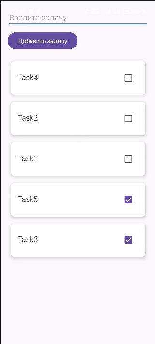

<div align="center">
    
МИНИСТЕРСТВО НАУКИ И ВЫСШЕГО ОБРАЗОВАНИЯ РОССИЙСКОЙ ФЕДЕРАЦИИ ФЕДЕРАЛЬНОЕ ГОСУДАРСТВЕННОЕ БЮДЖЕТНОЕ ОБРАЗОВАТЕЛЬНОЕ УЧРЕЖДЕНИЕ ВЫСШЕГО ОБРАЗОВАНИЯ
"САХАЛИНСКИЙ ГОСУДАРСТВЕННЫЙ УНИВЕРСИТЕТ»

<br><br><br><br>

Институт естественных наук и техносферной безопасности

Кафедра информатики

Лапырёнок Анастасия

<br><br><br><br>

Лабораторная работа №10

«Интеграция Room в проект. Сохранение списка задач в БД»

01.03.02 Прикладная математика и информатика

<br><br><br><br><br>

<div align="right">
Научный руководитель

Соболев Евгений Игоревич
</div>

<br><br><br><br><br>

г. Южно-Сахалинск
2026 г.

</div>

<br><br>

**Цель работы:** Изучить основы работы с Room Database — официальной библиотекой для работы с SQLite в Android. Научиться создавать Entity, DAO, Database, интегрировать Room с ViewModel и корутинами, обеспечить сохранение списка задач между сессиями приложения.

<br><br>

---

## Листинг файла `TaskEntity.kt`

```kotlin
package com.example.lab10.database

import androidx.room.Entity
import androidx.room.PrimaryKey

@Entity(tableName = "tasks") // Имя таблицы в БД
data class TaskEntity(
    @PrimaryKey(autoGenerate = true) // Автоматическая генерация ID
    val id: Long = 0,
    val title: String,          // Текст задачи
    val isCompleted: Boolean = false, // Статус выполнения
    val createdTime: Long = System.currentTimeMillis() // Время создания для сортировки
)
```

<br><br>

## Листинг файла `TaskDao.kt`

```kotlin
package com.example.lab10.database

import androidx.room.*
import kotlinx.coroutines.flow.Flow

@Dao
interface TaskDao {

    @Query("SELECT * FROM tasks ORDER BY createdTime DESC")
    fun getAllTasks(): Flow<List<TaskEntity>> // Возвращаем Flow для реактивного обновления

    @Insert(onConflict = OnConflictStrategy.REPLACE) // При конфликте заменять
    suspend fun insertTask(task: TaskEntity)

    @Update
    suspend fun updateTask(task: TaskEntity)

    @Delete
    suspend fun deleteTask(task: TaskEntity)

    @Query("DELETE FROM tasks")
    suspend fun deleteAll()

    @Query("SELECT * FROM tasks WHERE id = :id")
    suspend fun getTaskById(id: Long): TaskEntity?

    @Query("UPDATE tasks SET title = :newTitle WHERE title = :oldTitle")
    suspend fun updateTaskByTitle(oldTitle: String, newTitle: String)

    @Query("DELETE FROM tasks WHERE title = :title")
    suspend fun deleteTaskByTitle(title: String)

    @Query("SELECT * FROM tasks ORDER BY isCompleted ASC, createdTime DESC")
    fun getAllTasksSortedByStatusAndDate(): Flow<List<TaskEntity>>
}
```

<br><br>

## Листинг файла `AppDatabase.kt`

```kotlin
package com.example.lab10.database

import android.content.Context
import androidx.room.Database
import androidx.room.Room
import androidx.room.RoomDatabase

@Database(
    entities = [TaskEntity::class],
    version = 1,
    exportSchema = false
)
abstract class AppDatabase : RoomDatabase() {
    abstract fun taskDao(): TaskDao

    companion object {
        @Volatile
        private var INSTANCE: AppDatabase? = null

        fun getInstance(context: Context): AppDatabase {
            return INSTANCE ?: synchronized(this) {
                val instance = Room.databaseBuilder(
                    context.applicationContext,
                    AppDatabase::class.java,
                    "todo_database"
                )
                    //.fallbackToDestructiveMigration() // Для разработки: при изменении версии БД пересоздавать таблицы
                    .build()
                INSTANCE = instance
                instance
            }
        }
    }
}
```

<br><br>


## Листинг файла `MainViewModel.kt`

```kotlin
package com.example.lab10.ui.theme

import androidx.lifecycle.ViewModel
import androidx.lifecycle.viewModelScope
import com.example.lab10.database.AppDatabase
import com.example.lab10.database.TaskEntity
import kotlinx.coroutines.flow.*
import kotlinx.coroutines.launch

class MainViewModel(
    private val database: AppDatabase
) : ViewModel() {

    private val _tasks = MutableStateFlow<List<Pair<String, Boolean>>>(emptyList())
    private val taskDao = database.taskDao()

    // Получаем Flow из DAO и преобразуем в StateFlow для Compose/UI
    val tasks: StateFlow<List<TaskEntity>> = taskDao.getAllTasksSortedByStatusAndDate()
        .stateIn(
            scope = viewModelScope,
            started = SharingStarted.WhileSubscribed(5000),
            initialValue = emptyList()
        )

    fun addTask(title: String) {
        viewModelScope.launch {
            val task = TaskEntity(title = title)
            taskDao.insertTask(task)
        }
    }

    fun deleteTask(task: TaskEntity) {
        viewModelScope.launch {
            taskDao.deleteTask(task)
        }
    }

    fun updateTask(task: TaskEntity) {
        viewModelScope.launch {
            taskDao.updateTask(task)
        }
    }

    fun toggleTaskCompletion(task: TaskEntity, isCompleted: Boolean) {
        viewModelScope.launch {
            val updatedTask = task.copy(isCompleted = isCompleted)
            taskDao.updateTask(updatedTask)
        }
    }

    fun deleteAllTasks() {
        viewModelScope.launch {
            taskDao.deleteAll()
        }
    }

    fun updateTask(oldTitle: String, newTitle: String) {
        viewModelScope.launch {
            taskDao.updateTaskByTitle(oldTitle, newTitle)
        }
    }

    fun deleteTaskByText(title: String) {
        viewModelScope.launch {
            taskDao.deleteTaskByTitle(title)
        }
    }
}
```

<br><br>


## Листинг файла `MainActivity.kt`

```kotlin
package com.example.lab10

import android.content.Intent
import android.os.Bundle
import android.widget.Button
import android.widget.EditText
import android.widget.Toast
import androidx.activity.result.contract.ActivityResultContracts
import androidx.activity.viewModels
import androidx.appcompat.app.AppCompatActivity
import androidx.lifecycle.Lifecycle
import androidx.lifecycle.lifecycleScope
import androidx.lifecycle.repeatOnLifecycle
import androidx.recyclerview.widget.LinearLayoutManager
import androidx.recyclerview.widget.RecyclerView
import com.example.lab10.ui.theme.MainViewModel
import com.example.lab10.database.AppDatabase
import com.google.android.material.snackbar.Snackbar
import kotlinx.coroutines.launch

class MainActivity : AppCompatActivity() {
    // Получаем базу данных
    private val database by lazy { AppDatabase.getInstance(this) }
    private val viewModel: MainViewModel by viewModels {
        MainViewModelFactory(database)
    }
    private lateinit var adapter: TaskAdapter


    companion object {
        private const val EDIT_TASK_REQUEST_CODE = 1001
    }

    override fun onCreate(savedInstanceState: Bundle?) {
        super.onCreate(savedInstanceState)
        setContentView(R.layout.activity_main)

        val editTextTask = findViewById<EditText>(R.id.editTextTask)
        val buttonAddTask = findViewById<Button>(R.id.buttonAddTask)
        val recyclerView = findViewById<RecyclerView>(R.id.recyclerViewTasks)

        // Настройка RecyclerView
        recyclerView.layoutManager = LinearLayoutManager(this)
        adapter = TaskAdapter(
            tasks = emptyList(),
            onItemClick = { task ->
                val intent = Intent(this, DetailActivity::class.java)
                intent.putExtra("task_text", task.title)
                startActivityForResult(intent, EDIT_TASK_REQUEST_CODE)
            },
            onItemLongClick = { task ->
                viewModel.deleteTask(task)
                Toast.makeText(this, "Задача удалена", Toast.LENGTH_SHORT).show()
            },
            onCheckChange = { task, isChecked ->
                viewModel.toggleTaskCompletion(task, isChecked)
            }
        )
        recyclerView.adapter = adapter

        // Подписка на изменения списка задач
        lifecycleScope.launch {
            repeatOnLifecycle(Lifecycle.State.STARTED) {
                viewModel.tasks.collect { tasks ->
                    adapter.updateData(tasks)
                }
            }
        }

        // Добавление задачи
        buttonAddTask.setOnClickListener {
            val task = editTextTask.text.toString()
            if (task.isNotBlank()) {
                viewModel.addTask(task)
                editTextTask.text.clear()
            } else {
                Toast.makeText(this, "Введите задачу", Toast.LENGTH_SHORT).show()
            }
        }
    }

    override fun onActivityResult(requestCode: Int, resultCode: Int, data: Intent?) {
        super.onActivityResult(requestCode, resultCode, data)

        if (requestCode == EDIT_TASK_REQUEST_CODE && resultCode == RESULT_OK && data != null) {
            val action = data.getStringExtra("action")
            val dataString = data.getStringExtra("data")

            when (action) {
                "edit" -> {
                    val parts = dataString?.split("|")
                    if (parts != null && parts.size == 2) {
                        val oldText = parts[0]
                        val newText = parts[1]
                        if (oldText.isNotBlank() && newText.isNotBlank()) {
                            viewModel.updateTask(oldText, newText)
                        } else {
                            Toast.makeText(this, "Некорректные данные для редактирования", Toast.LENGTH_SHORT).show()
                        }
                    } else {
                        Toast.makeText(this, "Ошибка при разборе данных", Toast.LENGTH_SHORT).show()
                    }
                }
                "delete" -> {
                    if (!dataString.isNullOrEmpty()) {
                        viewModel.deleteTaskByText(dataString)
                    } else {
                        Toast.makeText(this, "Не удалось получить текст задачи для удаления", Toast.LENGTH_SHORT).show()
                    }
                }
            }
        }
    }
}
```

<br><br>

## Листинг файла `TaskAdapter.kt`

```kotlin
package com.example.lab10

import android.view.LayoutInflater
import android.view.View
import android.view.ViewGroup
import android.widget.CheckBox
import android.widget.TextView
import androidx.recyclerview.widget.DiffUtil
import androidx.recyclerview.widget.RecyclerView
import com.example.lab10.database.TaskEntity

class TaskAdapter(
    private var tasks: List<TaskEntity>,
    private val onItemClick: (TaskEntity) -> Unit,
    private val onItemLongClick: (TaskEntity) -> Unit,
    private val onCheckChange: (TaskEntity, Boolean) -> Unit
) : RecyclerView.Adapter<TaskAdapter.TaskViewHolder>() {

    class TaskViewHolder(itemView: View) : RecyclerView.ViewHolder(itemView) {
        val textTask: TextView = itemView.findViewById(R.id.textTask)
        val checkTask: CheckBox = itemView.findViewById(R.id.checkTask)
    }

    override fun onCreateViewHolder(parent: ViewGroup, viewType: Int): TaskViewHolder {
        val view = LayoutInflater.from(parent.context)
            .inflate(R.layout.item_task, parent, false)
        return TaskViewHolder(view)
    }

    override fun onBindViewHolder(holder: TaskViewHolder, position: Int) {
        val task = tasks[position]
        holder.textTask.text = task.title

        // Отключаем слушатель, чтобы избежать двойного вызова
        holder.checkTask.setOnCheckedChangeListener(null)

        // Явно устанавливаем состояние из модели
        holder.checkTask.isChecked = task.isCompleted

        // Настраиваем слушатель после установки значения
        holder.checkTask.setOnCheckedChangeListener { _, isChecked ->
            onCheckChange(task, isChecked)
        }

        holder.itemView.setOnClickListener {
            onItemClick(task)
        }

        holder.itemView.setOnLongClickListener {
            onItemLongClick(task)
            true
        }
    }
    
    override fun getItemCount(): Int = tasks.size

    fun updateData(newTasks: List<TaskEntity>) {
        val diffCallback = TaskDiffCallback(tasks, newTasks)
        val diffResult = DiffUtil.calculateDiff(diffCallback)
        tasks = newTasks // Заменяем старый список новым
        diffResult.dispatchUpdatesTo(this)
    }
    class TaskDiffCallback(
        private val oldList: List<TaskEntity>,
        private val newList: List<TaskEntity>
    ) : DiffUtil.Callback() {
        override fun getOldListSize() = oldList.size
        override fun getNewListSize() = newList.size

        override fun areItemsTheSame(oldItemPosition: Int, newItemPosition: Int): Boolean {
            return oldList[oldItemPosition].id == newList[newItemPosition].id
        }

        override fun areContentsTheSame(oldItemPosition: Int, newItemPosition: Int): Boolean {
            val oldItem = oldList[oldItemPosition]
            val newItem = newList[newItemPosition]
            // Сравниваем ВСЕ поля, влияющие на UI
            return oldItem.title == newItem.title &&
                    oldItem.isCompleted == newItem.isCompleted &&
                    oldItem.createdTime == newItem.createdTime
        }
    }
}
```

<br><br>

## Скриншот приложения с отображением результатов


<br><br>

---

## Ответы на контрольные вопросы:

### 1. Для чего нужна библиотека Room? Какие проблемы она решает по сравнению с прямым использованием SQLite?

**Room** — это ORM‑библиотека (Object‑Relational Mapping) от Google для работы с SQLite в Android‑приложениях.

**Решает следующие проблемы прямого использования SQLite:**

* **Отсутствие типобезопасности:** Room проверяет SQL‑запросы на этапе компиляции, снижая риск ошибок во время выполнения.
* **Много шаблонного кода:** автоматически генерирует код для преобразования данных между объектами Kotlin/Java и таблицами SQLite.
* **Ручное управление соединениями:** абстрагирует работу с `SQLiteDatabase`, упрощая открытие/закрытие соединений.
* **Сложность миграции:** предоставляет инструменты для управления миграциями базы данных.
* **Интеграция с современными паттернами:** легко интегрируется с `LiveData`, `Flow`, `Coroutines` и архитектурными компонентами Android.


### 2. Назовите три основных компонента Room и объясните их назначение

**Три основных компонента Room:**

1. **Entity (Сущность):** класс Kotlin/Java, представляющий таблицу в базе данных. Аннотируется `@Entity`. Поля класса соответствуют столбцам таблицы.
2. **DAO (Data Access Object / Объект доступа к данным):** интерфейс или абстрактный класс с методами для выполнения операций с БД (запросы, вставки, обновления, удаления). Аннотируется `@Dao`. Содержит методы с аннотациями `@Query`, `@Insert`, `@Update`, `@Delete`.
3. **Database:** абстрактный класс, наследующий `RoomDatabase`. Является точкой входа для взаимодействия с базой данных. Аннотируется `@Database`. Описывает список сущностей и версию базы данных, содержит абстрактные методы для получения экземпляров DAO.


### 3. Почему методы DAO, изменяющие данные, объявляются как `suspend`?

Методы DAO, изменяющие данные (`@Insert`, `@Update`, `@Delete`), объявляются как `suspend`, потому что:

* **Операции с БД — блокирующие:** доступ к базе данных может занять значительное время и блокировать основной поток.
* **Использование Coroutines:** `suspend`-функции позволяют выполнять длительные операции асинхронно без блокировки потока.
* **Предотвращение ANR:** выполнение операций с БД в основном потоке приводит к ошибкам ANR (Application Not Responding). `suspend`-функции гарантируют, что код будет выполняться в фоновом корутине.
* **Согласованность с Flow:** методы, возвращающие `Flow`, также являются `suspend`, что обеспечивает единообразный асинхронный API.


### 4. Что такое Flow и почему его удобно использовать с Room?

**Flow** — это асинхронный поток данных в Kotlin Coroutines, позволяющий последовательно выдавать 0 или более значений.

**Удобство использования с Room:**

* **Автоматическое обновление:** Room автоматически перевыполняет запрос и выдаёт новые данные в `Flow`, когда данные в соответствующей таблице изменяются.
* **Реактивность:** UI или другие компоненты могут подписываться на `Flow` и автоматически обновляться при изменении данных.
* **Асинхронность:** `Flow` работает с корутинами, обеспечивая неблокирующую обработку данных.
* **Гибкость:** поддерживает операторы трансформации (`map`, `filter` и т. д.) для обработки данных перед отправкой подписчику.
* **Ленивость:** данные запрашиваются только тогда, когда есть подписчик (`collect`).

Пример: метод DAO `fun getAllUsers(): Flow<List<User>>` будет выдавать список пользователей и автоматически обновлять его при добавлении/удалении/изменении записей в таблице `User`.


### 5. Как Room обеспечивает проверку SQL‑запросов на этапе компиляции?

Room обеспечивает проверку SQL‑запросов на этапе компиляции с помощью **процессора аннотаций (Annotation Processor)**:

1. **Анализ аннотаций:** процессор аннотаций Room анализирует код во время компиляции, в частности, методы с аннотацией `@Query`.
2. **Валидация запроса:** процессор проверяет SQL‑запрос в аннотации `@Query` на соответствие схеме базы данных, определённой в классе `@Database` (через список `entities`).
3. **Проверка имён таблиц и столбцов:** сверяет имена таблиц и столбцов в запросе с именами, определёнными в классах `@Entity`.
4. **Проверка типов:** убеждается, что типы данных, возвращаемые запросом, соответствуют типам данных в объекте‑результате (например, в `List<User>`).
5. **Генерация ошибок:** если запрос некорректен (не существует таблица/столбец, несоответствие типов), процессор генерирует ошибку компиляции. Это позволяет обнаружить ошибки до запуска приложения.


### 6. Зачем нужен паттерн Singleton для экземпляра базы данных?

Паттерн **Singleton** для экземпляра базы данных Room нужен для:

* **Единственности подключения:** гарантирует, что в приложении существует только один экземпляр базы данных и одно подключение к ней. Это предотвращает конфликты и ошибки при одновременном доступе из разных частей приложения.
* **Оптимизации ресурсов:** создание экземпляра `RoomDatabase` — ресурсоёмкая операция. Singleton позволяет создать его один раз и переиспользовать, экономя память и время.
* **Согласованности данных:** все компоненты приложения работают с одним и тем же экземпляром БД, что гарантирует актуальность и согласованность данных во всём приложении.
* **Правильного управления жизненным циклом:** экземпляр БД создаётся при запуске приложения и уничтожается при его закрытии, что соответствует принципам управления ресурсами в Android.

Обычно реализуется через `object` в Kotlin или статический метод `getInstance()` в Java внутри класса, наследующего `RoomDatabase`.

---

## Вывод

В ходе работы успешно освоены основы работы с библиотекой Room Database для Android — официальной обёрткой над SQLite. Реализовано приложение для управления списком задач с сохранением данных между сессиями.

Достигнуты все поставленные цели:

1. Созданы ключевые компоненты Room:
   * **Entity** (`TaskEntity`) — определена структура таблицы задач;
   * **DAO** (`TaskDao`) — реализованы операции CRUD и дополнительные запросы (сортировка, фильтрация);
   * **Database** (`AppDatabase`) — настроен экземпляр БД с использованием паттерна Singleton.

2. Обеспечена интеграция Room с современными инструментами Android‑разработки:
   * с **ViewModel** (`MainViewModel`) — для хранения и предоставления данных UI;
   * с **Coroutines** — для асинхронного выполнения операций с БД и предотвращения ANR‑ошибок;
   * с **Flow** — для реактивного обновления списка задач в UI при изменении данных в БД.

3. Реализован пользовательский интерфейс на базе **RecyclerView** с адаптером (`TaskAdapter`), который:
   * эффективно обновляет данные через `DiffUtil`;
   * обрабатывает действия пользователя (добавление, удаление, редактирование, отметка выполнения задач).

4. Проверено на практике преимущество Room перед прямым использованием SQLite:
   * типобезопасность SQL‑запросов (проверка на этапе компиляции);
   * сокращение объёма шаблонного кода;
   * упрощённое управление подключениями к БД;
   * бесшовная интеграция с архитектурными компонентами Android.

Полученное решение демонстрирует надёжный и масштабируемый подход к работе с локальными данными в Android‑приложениях. Оно соответствует современным рекомендациям Google по архитектуре приложений и готово к дальнейшему развитию — например, к добавлению миграций БД, расширенной фильтрации задач или синхронизации с сервером.