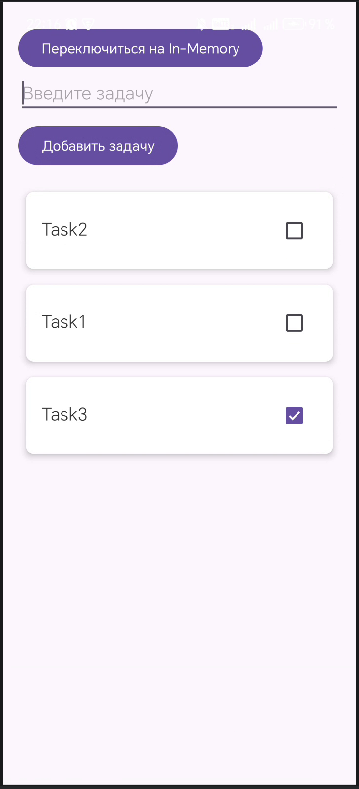

<div align="center">
    
МИНИСТЕРСТВО НАУКИ И ВЫСШЕГО ОБРАЗОВАНИЯ РОССИЙСКОЙ ФЕДЕРАЦИИ ФЕДЕРАЛЬНОЕ ГОСУДАРСТВЕННОЕ БЮДЖЕТНОЕ ОБРАЗОВАТЕЛЬНОЕ УЧРЕЖДЕНИЕ ВЫСШЕГО ОБРАЗОВАНИЯ
"САХАЛИНСКИЙ ГОСУДАРСТВЕННЫЙ УНИВЕРСИТЕТ»

<br><br><br><br>

Институт естественных наук и техносферной безопасности

Кафедра информатики

Лапырёнок Анастасия

<br><br><br><br>

Лабораторная работа №11

«Рефакторинг: добавление слоя Repository между ViewModel и Room»

01.03.02 Прикладная математика и информатика

<br><br><br><br><br>

<div align="right">
Научный руководитель

Соболев Евгений Игоревич
</div>

<br><br><br><br><br>

г. Южно-Сахалинск
2026 г.

</div>

<br><br>

**Цель работы:** Изучить архитектурный паттерн Repository, научиться выделять слой доступа к данным, отделяя его от бизнес-логики, выполнить рефакторинг существующего приложения для использования репозитория.

<br><br>

---

## Листинг файла `TaskRepository.kt`

```kotlin
package com.example.lab11.data.repository

import com.example.lab11.database.TaskEntity
import kotlinx.coroutines.flow.Flow

interface TaskRepository {
    fun getAllTasks(): Flow<List<TaskEntity>>
    fun getAllSortedTasks(): Flow<List<TaskEntity>>
    suspend fun addTask(title: String)
    suspend fun deleteTask(task: TaskEntity)
    suspend fun updateTask(task: TaskEntity)
    suspend fun toggleTaskCompletion(task: TaskEntity, isCompleted: Boolean)
    suspend fun deleteAllTasks()
    suspend fun updateTaskByTitle(oldTitle: String, newTitle: String)
    suspend fun deleteTaskByTitle(title: String)
}
```

<br><br>

## Листинг файла `TaskRepositoryImpl.kt`

```kotlin
package com.example.lab11.data.repository

import com.example.lab11.database.TaskDao
import com.example.lab11.database.TaskEntity
import kotlinx.coroutines.flow.Flow
import javax.inject.Inject

class TaskRepositoryImpl(
    private val taskDao: TaskDao
) : TaskRepository {

    override fun getAllTasks(): Flow<List<TaskEntity>> = taskDao.getAllTasks()

    override fun getAllSortedTasks(): Flow<List<TaskEntity>> = taskDao.getAllTasksSortedByStatusAndDate()

    override suspend fun addTask(title: String) {
        val task = TaskEntity(title = title)
        taskDao.insertTask(task)
    }

    override suspend fun deleteTask(task: TaskEntity) {
        taskDao.deleteTask(task)
    }

    override suspend fun updateTask(task: TaskEntity) {
        taskDao.updateTask(task)
    }

    override suspend fun toggleTaskCompletion(task: TaskEntity, isCompleted: Boolean) {
        val updatedTask = task.copy(isCompleted = isCompleted)
        taskDao.updateTask(updatedTask)
    }

    override suspend fun deleteAllTasks() {
        taskDao.deleteAll()
    }

    override suspend fun updateTaskByTitle(oldTitle: String, newTitle: String) {
        taskDao.updateTaskByTitle(oldTitle, newTitle)
    }

    override suspend fun deleteTaskByTitle(title: String) {
        taskDao.deleteTaskByTitle(title)
    }
}
```

<br><br>

## Листинг файла `InMemoryTaskRepository.kt`

```kotlin
package com.example.lab11.data.repository

import com.example.lab11.database.TaskEntity
import kotlinx.coroutines.flow.Flow
import kotlinx.coroutines.flow.MutableStateFlow
import kotlinx.coroutines.flow.asStateFlow
import kotlinx.coroutines.flow.map


class InMemoryTaskRepository : TaskRepository {
    private var nextId: Long = 1L
    private val _tasks = MutableStateFlow<List<TaskEntity>>(emptyList())
    private val tasks = _tasks.asStateFlow()

    override fun getAllTasks(): Flow<List<TaskEntity>> = tasks

    override fun getAllSortedTasks(): Flow<List<TaskEntity>> = tasks.map { taskList ->
        taskList.sortedWith(
            compareBy<TaskEntity> { it.isCompleted }
                .thenByDescending { it.createdTime }
        )
    }

    override suspend fun addTask(title: String) {
        val newTask = TaskEntity(
            id = nextId++,
            title = title,
            isCompleted = false,
            createdTime = System.currentTimeMillis()
        )
        val currentTasks = _tasks.value
        _tasks.value = currentTasks + newTask
    }

    override suspend fun deleteTask(task: TaskEntity) {
        val currentTasks = _tasks.value
        _tasks.value = currentTasks.filter { it.id != task.id }
    }

    override suspend fun updateTask(task: TaskEntity) {
        val currentTasks = _tasks.value
        _tasks.value = currentTasks.map { existingTask ->
            if (existingTask.id == task.id) task else existingTask
        }
    }

    override suspend fun toggleTaskCompletion(task: TaskEntity, isCompleted: Boolean) {
        val updatedTask = task.copy(isCompleted = isCompleted)
        updateTask(updatedTask)
    }

    override suspend fun deleteAllTasks() {
        _tasks.value = emptyList()
    }

    override suspend fun updateTaskByTitle(oldTitle: String, newTitle: String) {
        val currentTasks = _tasks.value
        val taskToUpdate = currentTasks.find { it.title == oldTitle }
        if (taskToUpdate != null) {
            val updatedTask = taskToUpdate.copy(title = newTitle)
            updateTask(updatedTask)
        }
    }

    override suspend fun deleteTaskByTitle(title: String) {
        val currentTasks = _tasks.value
        val taskToDelete = currentTasks.find { it.title == title }
        if (taskToDelete != null) {
            deleteTask(taskToDelete)
        }
    }
}
```

<br><br>

## Листинг файла `MainViewModel.kt`

```kotlin
package com.example.lab11.ui.theme

import androidx.lifecycle.ViewModel
import androidx.lifecycle.viewModelScope
import com.example.lab11.data.repository.TaskRepository
import com.example.lab11.database.AppDatabase
import com.example.lab11.database.TaskEntity
import kotlinx.coroutines.flow.*
import kotlinx.coroutines.launch

class MainViewModel(
    private val repository: TaskRepository
) : ViewModel() {

    val _tasks = MutableStateFlow<List<TaskEntity>>(emptyList())

    val tasks: StateFlow<List<TaskEntity>> = repository.getAllSortedTasks()
        .stateIn(
            scope = viewModelScope,
            started = SharingStarted.WhileSubscribed(5000),
            initialValue = emptyList()
        )

    fun addTask(title: String) {
        viewModelScope.launch {
            repository.addTask(title)
        }
    }

    fun deleteTask(task: TaskEntity) {
        viewModelScope.launch {
            repository.deleteTask(task)
        }
    }

    fun toggleTaskCompletion(task: TaskEntity, isCompleted: Boolean) {
        viewModelScope.launch {
            repository.toggleTaskCompletion(task, isCompleted)
        }
    }

    fun deleteAllTasks() {
        viewModelScope.launch {
            repository.deleteAllTasks()
        }
    }

    fun updateTask(oldTitle: String, newTitle: String) {
        viewModelScope.launch {
            repository.updateTaskByTitle(oldTitle, newTitle)
        }
    }

    fun deleteTaskByText(title: String) {
        viewModelScope.launch {
            repository.deleteTaskByTitle(title)
        }
    }
}
```

<br><br>

## Листинг файла `MainViewModelFactory.kt`

```kotlin
package com.example.lab11

import androidx.lifecycle.ViewModel
import androidx.lifecycle.ViewModelProvider
import com.example.lab11.data.repository.TaskRepository
import com.example.lab11.ui.theme.MainViewModel

class MainViewModelFactory(
    private val repository: TaskRepository
) : ViewModelProvider.Factory {
    override fun <T : ViewModel> create(modelClass: Class<T>): T {
        if (modelClass.isAssignableFrom(MainViewModel::class.java)) {
            @Suppress("UNCHECKED_CAST")
            return MainViewModel(repository) as T
        }
        throw IllegalArgumentException("Unknown ViewModel class")
    }
}
```

<br><br>

## Листинг файла `MainActivity.kt`

```kotlin
package com.example.lab11

import android.content.Intent
import android.os.Bundle
import android.widget.Button
import android.widget.EditText
import android.widget.Toast
import androidx.activity.viewModels
import androidx.appcompat.app.AppCompatActivity
import androidx.lifecycle.Lifecycle
import androidx.lifecycle.lifecycleScope
import androidx.lifecycle.repeatOnLifecycle
import androidx.recyclerview.widget.LinearLayoutManager
import androidx.recyclerview.widget.RecyclerView
import com.example.lab11.data.repository.InMemoryTaskRepository
import com.example.lab11.ui.theme.MainViewModel
import com.example.lab11.database.AppDatabase
import com.example.lab11.data.repository.TaskRepositoryImpl
import kotlinx.coroutines.launch
import com.example.lab11.data.repository.TaskRepository


class MainActivity : AppCompatActivity() {
    private var useInMemoryRepository = false
    private lateinit var repository: TaskRepository
    private lateinit var viewModel: MainViewModel
    private lateinit var adapter: TaskAdapter

    companion object {
        private const val EDIT_TASK_REQUEST_CODE = 1001
    }

    override fun onCreate(savedInstanceState: Bundle?) {
        super.onCreate(savedInstanceState)
        setContentView(R.layout.activity_main)

        val editTextTask = findViewById<EditText>(R.id.editTextTask)
        val buttonAddTask = findViewById<Button>(R.id.buttonAddTask)
        val buttonToggleRepository = findViewById<Button>(R.id.buttonToggleRepository)
        val recyclerView = findViewById<RecyclerView>(R.id.recyclerViewTasks)

        // Инициализация начального репозитория и ViewModel
        updateRepositoryAndViewModel() // Сначала инициализируем репозиторий
        updateButtonText() // Затем устанавливаем начальный текст кнопки

        // Настройка RecyclerView
        recyclerView.layoutManager = LinearLayoutManager(this)
        adapter = TaskAdapter(
            tasks = emptyList(),
            onItemClick = { task ->
                val intent = Intent(this, DetailActivity::class.java)
                intent.putExtra("task_text", task.title)
                startActivityForResult(intent, EDIT_TASK_REQUEST_CODE)
            },
            onItemLongClick = { task ->
                viewModel.deleteTask(task)
                Toast.makeText(this, "Задача удалена", Toast.LENGTH_SHORT).show()
            },
            onCheckChange = { task, isChecked ->
                viewModel.toggleTaskCompletion(task, isChecked)
            }
        )
        recyclerView.adapter = adapter

        // Подписка на изменения списка задач
        subscribeToTasks()

        // Добавление задачи
        buttonAddTask.setOnClickListener {
            val task = editTextTask.text.toString()
            if (task.isNotBlank()) {
                viewModel.addTask(task)
                editTextTask.text.clear()
            } else {
                Toast.makeText(this, "Введите задачу", Toast.LENGTH_SHORT).show()
            }
        }

        // Кнопка переключения репозитория
        buttonToggleRepository.setOnClickListener {
            useInMemoryRepository = !useInMemoryRepository
            updateRepositoryAndViewModel()
            subscribeToTasks() // Переподписываемся на новые данные
            Toast.makeText(
                this,
                if (useInMemoryRepository) "Переключено на In‑Memory хранилище"
                else "Переключено на БД хранилище",
                Toast.LENGTH_SHORT
            ).show()
        }
        buttonToggleRepository.setOnClickListener {
            useInMemoryRepository = !useInMemoryRepository
            updateRepositoryAndViewModel()
            subscribeToTasks()
            Toast.makeText(
                this,
                if (useInMemoryRepository) "Переключено на In‑Memory хранилище"
                else "Переключено на БД хранилище",
                Toast.LENGTH_SHORT
            ).show()
            updateButtonText() // Обновляем текст после переключения
        }

    }

    private fun updateRepositoryAndViewModel() {
        repository = if (useInMemoryRepository) {
            InMemoryTaskRepository()
        } else {
            TaskRepositoryImpl(AppDatabase.getInstance(this).taskDao())
        }
        viewModel = MainViewModel(repository)
        updateButtonText() // Обновляем текст кнопки
    }

    private fun updateButtonText() {
        val buttonToggleRepository = findViewById<Button>(R.id.buttonToggleRepository)
        buttonToggleRepository.text = if (useInMemoryRepository) {
            "Переключиться на БД"
        } else {
            "Переключиться на In‑Memory"
        }
    }


    private fun subscribeToTasks() {
        lifecycleScope.launch {
            repeatOnLifecycle(Lifecycle.State.STARTED) {
                viewModel.tasks.collect { tasks ->
                    adapter.updateData(tasks)
                }
            }
        }
    }

    override fun onActivityResult(requestCode: Int, resultCode: Int, data: Intent?) {
        super.onActivityResult(requestCode, resultCode, data)

        if (requestCode == EDIT_TASK_REQUEST_CODE && resultCode == RESULT_OK && data != null) {
            val action = data.getStringExtra("action")
            val dataString = data.getStringExtra("data")

            when (action) {
                "edit" -> {
                    val parts = dataString?.split("|")
                    if (parts != null && parts.size == 2) {
                        val oldText = parts[0]
                        val newText = parts[1]
                        if (oldText.isNotBlank() && newText.isNotBlank()) {
                            viewModel.updateTask(oldText, newText)
                        } else {
                            Toast.makeText(this, "Некорректные данные для редактирования", Toast.LENGTH_SHORT).show()
                        }
                    } else {
                        Toast.makeText(this, "Ошибка при разборе данных", Toast.LENGTH_SHORT).show()
                    }
                }
                "delete" -> {
                    if (!dataString.isNullOrEmpty()) {
                        viewModel.deleteTaskByText(dataString)
                    } else {
                        Toast.makeText(this, "Не удалось получить текст задачи для удаления", Toast.LENGTH_SHORT).show()
                    }
                }
            }
        }
    }
}
```

<br><br>

## Скриншот приложения с отображением результатов


<br><br>

---

## Ответы на контрольные вопросы:

### 1. Какую роль выполняет слой Repository в архитектуре приложения?

Слой **Repository** (репозиторий) выполняет роль центрального хранилища данных и координатора источников данных в архитектуре приложения. Его ключевые функции:

* **Абстракция источников данных.** Скрывает детали реализации — откуда берутся данные (локальная БД Room, сетевое API, кэш и т. д.).
* **Унификация доступа.** Предоставляет единый API для получения и сохранения данных независимо от их источника.
* **Оркестрация данных.** Объединяет данные из разных источников (например, сначала берёт из локального кэша, затем обновляет с сервера).
* **Бизнес‑логика на уровне данных.** Реализует правила обработки данных: валидацию, трансформацию, агрегацию.
* **Кэширование.** Может хранить часто используемые данные для ускорения доступа и снижения нагрузки на сеть/БД.
* **Управление синхронизацией.** Координирует синхронизацию между локальными и удалёнными данными.

В итоге ViewModel взаимодействует только с репозиторием, не зная о конкретных механизмах получения данных.

### 2. Какие преимущества даёт использование Repository по сравнению с прямым обращением к DAO из ViewModel?

Использование **Repository** вместо прямого обращения к **DAO** из **ViewModel** даёт следующие преимущества:

* **Разделение ответственности.** ViewModel отвечает за состояние UI, Repository — за получение и обработку данных. Это соответствует принципу единственной ответственности (SRP).
* **Тестируемость.** Репозиторий можно легко мокировать в unit‑тестах ViewModel, изолируя её от реальной БД.
* **Гибкость и расширяемость.** Добавление нового источника данных (например, сетевого API) не затрагивает ViewModel — изменения вносятся только в репозиторий.
* **Повторное использование кода.** Логика доступа к данным централизована в репозитории и может использоваться несколькими ViewModel.
* **Упрощение ViewModel.** ViewModel становится «тоньше» — она не содержит сложной логики работы с данными, а лишь вызывает методы репозитория.
* **Изоляция изменений.** Изменения в слое данных (смена ORM, изменение структуры БД) не затрагивают ViewModel.
* **Централизованное управление ошибками.** Обработка исключений и ошибок сети/БД сосредоточена в репозитории.

### 3. Как изменится ViewModel, если мы захотим добавить ещё один источник данных (например, сетевое API)?

При добавлении нового источника данных (например, **сетевого API**) **ViewModel практически не изменится**. Вот как это работает:

1. **Изменения в репозитории:**
    * Добавляется зависимость от сетевого API (например, Retrofit).
    * Реализуется логика комбинирования источников: например, сначала берутся данные из локальной БД (Room), затем асинхронно запрашиваются свежие данные с сервера.
    * Обновляются методы репозитория для работы с новым источником (например, добавление методов загрузки с сервера и синхронизации).

2. **Логика в репозитории:**
    * Репозиторий решает, когда обращаться к сети, а когда брать данные из кэша.
    * Реализуется стратегия синхронизации (например, «сначала кэш, потом сеть» или «только сеть»).
    * Обрабатываются сетевые ошибки и конфликты данных.

3. **Отсутствие изменений в ViewModel:**
    * ViewModel продолжает вызывать те же методы репозитория (например, `getUsers()`).
    * Она не знает и не должна знать, откуда берутся данные — из БД, сети или их комбинации.
    * UI продолжает обновляться через `LiveData`/`StateFlow` так же, как и раньше.

Таким образом, вся сложность добавления нового источника данных локализуется в слое репозитория, а ViewModel остаётся неизменной.

### 4. Почему методы репозитория объявлены как `suspend`?

Методы репозитория объявляются как **`suspend`** по следующим причинам:

* **Асинхронность операций.** Операции с данными (запросы к БД, сетевые вызовы) могут занимать значительное время. `suspend`-функции позволяют выполнять их асинхронно, не блокируя основной поток.
* **Предотвращение ANR.** Длительные операции в основном потоке приводят к ошибкам ANR (Application Not Responding). Корутины с `suspend`-функциями гарантируют выполнение в фоновом контексте.
* **Согласованность API.** Если часть методов репозитория выполняет асинхронные операции (например, сетевые запросы), то все методы лучше сделать `suspend` для единообразия.
* **Интеграция с корутинами.** Репозиторий может комбинировать вызовы к разным асинхронным источникам (БД, сеть) в одной корутине, используя `withContext`, `async` и т. д.
* **Обработка ошибок.** Исключения из асинхронных операций (сетевые ошибки, ошибки БД) могут быть обработаны в том же корутинном блоке.
* **Поддержка Flow/StateFlow.** Методы репозитория могут возвращать `Flow` или `StateFlow`, которые естественно работают с корутинами.
* **Последовательность выполнения.** В корутине можно последовательно выполнить несколько асинхронных вызовов (например, сохранить в БД → отправить на сервер → обновить статус), сохраняя читаемость кода.

Пример:
```kotlin
suspend fun getUser(id: Int): User {
    // Сначала берём из БД (асинхронно)
    val localUser = userDao.getUserById(id)
    // Затем обновляем с сервера (асинхронно)
    val remoteUser = apiService.fetchUser(id)
    // Сохраняем обновлённые данные в БД
    userDao.updateUser(remoteUser)
    return remoteUser
}
```

### 5. Что такое инверсия зависимостей и как она применяется в данном рефакторинге?

**Инверсия зависимостей** (Dependency Inversion) — это принцип из SOLID (DIP — Dependency Inversion Principle), который гласит:

> A. Модули верхних уровней не должны зависеть от модулей нижних уровней. Оба должны зависеть от абстракций.  
> B. Абстракции не должны зависеть от деталей. Детали должны зависеть от абстракций.

**Применение в рефакторинге с Repository:**

1. **До рефакторинга (нарушение DIP):**
    * **ViewModel** (модуль верхнего уровня) напрямую зависит от **DAO** (модуль нижнего уровня, конкретная реализация).
    * Это жёсткая связь: ViewModel привязана к конкретной БД (Room) и не может работать с другими источниками данных без изменений.

2. **После рефакторинга (соблюдение DIP):**
    * Создаётся **абстрактный интерфейс репозитория** (абстракция).
    * **ViewModel** зависит только от этого интерфейса, а не от конкретной реализации.
    * Конкретная реализация репозитория (например, `UserRepositoryImpl`) зависит от абстракции (интерфейса репозитория) и реализует её.
    * Реализация репозитория зависит от деталей (DAO, Retrofit, кэша и т. д.), а не наоборот.

**Схема зависимостей после рефакторинга:**

```
ViewModel (верхний уровень)
     ↓ (зависит от абстракции)
IUserRepository (интерфейс, абстракция)
     ↑ (реализует абстракцию, зависит от неё)
UserRepositoryImpl (конкретная реализация)
     ↓ (зависит от деталей)
DAO, API Service, Cache (нижние уровни)
```

**Преимущества применения DIP:**
* **Снижение связанности.** ViewModel не привязана к конкретным технологиям доступа к данным.
* **Лёгкость замены реализаций.** Можно создать другую реализацию репозитория (например, для тестирования — `TestUserRepository`) без изменения ViewModel.
* **Расширяемость.** Добавление новых источников данных не затрагивает модули верхнего уровня.
* **Улучшенная тестируемость.** В тестах ViewModel можно внедрить мок‑репозиторий, имитирующий разные сценарии (успех, ошибка, задержка).

---

## Вывод

В ходе работы успешно выполнен рефакторинг приложения с внедрением архитектурного паттерна **Repository**. Цель — выделить слой доступа к данным и отделить его от бизнес‑логики — достигнута.

**Что дало добавление слоя Repository:**

* **Разделение ответственности.** ViewModel теперь отвечает исключительно за состояние UI, а работа с данными вынесена в репозиторий. Это соответствует принципу единственной ответственности (SRP).
* **Гибкость архитектуры.** Реализована возможность динамически переключать источники данных прямо в работающем приложении: между локальной БД (Room) и in‑memory‑хранилищем (`InMemoryTaskRepository`).
* **Упрощение тестирования.** Благодаря интерфейсу `TaskRepository` можно легко подменять реализации в тестах — например, использовать мок‑репозиторий вместо реального.
* **Снижение связанности.** ViewModel зависит только от абстракции (`TaskRepository`), а не от конкретных реализаций (DAO или in‑memory). Это реализует принцип инверсии зависимостей (DIP).
* **Унификация API.** Все операции с задачами (добавление, удаление, обновление и т. д.) доступны через единый интерфейс репозитория, независимо от источника данных.
* **Поддержка асинхронности.** Использование `suspend`-функций и `Flow` обеспечивает неблокирующую работу с данными и автоматическое обновление UI при изменении данных.

**Перспективы, которые открывает внедрение Repository:**

* **Добавление сетевых источников данных.** Легко интегрировать API‑запросы (например, через Retrofit): логика загрузки и синхронизации с сервером будет локализована в новой реализации репозитория.
* **Реализация стратегий кэширования.** Можно добавить комбинированные стратегии («сначала кэш, потом сеть», «только сеть» и т. д.) без изменений в ViewModel.
* **Расширение сценариев тестирования.** Возможность создавать специализированные тестовые реализации репозитория для проверки крайних случаев: медленные ответы, сетевые ошибки, пустые данные и т. п.
* **Масштабирование приложения.** При добавлении новых экранов и ViewModel они могут переиспользовать тот же интерфейс репозитория, что снижает дублирование кода.
* **Оптимизация производительности.** В будущих версиях можно внедрить фоновые задачи синхронизации, пакетные операции с данными или локальное кэширование без влияния на UI‑слой.
* **Поддержка офлайн‑режима.** С текущей архитектурой проще реализовать сохранение операций в очередь при отсутствии сети и их последующую синхронизацию.

Таким образом, внедрение слоя Repository существенно повысило гибкость, тестируемость и поддерживаемость кода, создав прочную основу для дальнейшего развития приложения.