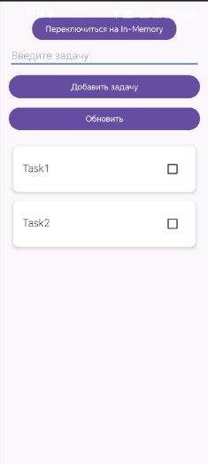

<div align="center">
    
МИНИСТЕРСТВО НАУКИ И ВЫСШЕГО ОБРАЗОВАНИЯ РОССИЙСКОЙ ФЕДЕРАЦИИ ФЕДЕРАЛЬНОЕ ГОСУДАРСТВЕННОЕ БЮДЖЕТНОЕ ОБРАЗОВАТЕЛЬНОЕ УЧРЕЖДЕНИЕ ВЫСШЕГО ОБРАЗОВАНИЯ
"САХАЛИНСКИЙ ГОСУДАРСТВЕННЫЙ УНИВЕРСИТЕТ»

<br><br><br><br>

Институт естественных наук и техносферной безопасности

Кафедра информатики

Лапырёнок Анастасия

<br><br><br><br>

Лабораторная работа №12

«Выполнение длительных операций (симуляция загрузки) с использованием viewModelScope»

01.03.02 Прикладная математика и информатика

<br><br><br><br><br>

<div align="right">
Научный руководитель

Соболев Евгений Игоревич
</div>

<br><br><br><br><br>

г. Южно-Сахалинск
2026 г.

</div>

<br><br>

**Цель работы:** Научиться выполнять длительные операции в фоновом потоке с использованием корутин и viewModelScope, управлять состоянием загрузки в UI, реализовать имитацию загрузки данных и обработку ошибок.

<br><br>

---

## Листинг файла `UiState.kt`

```kotlin
package com.example.lab12.ui.theme

import com.example.lab12.database.TaskEntity

sealed class TasksUiState {
    object Loading : TasksUiState()
    data class Success(val tasks: List<TaskEntity>) : TasksUiState()
    data class Error(
        val message: String,
        val canRetry: Boolean = true,
        val tasks: List<TaskEntity>? = null // Сохраняем текущий список
    ) : TasksUiState()
}
```

<br><br>

## Листинг файла `MainViewModel.kt`

```kotlin
package com.example.lab12.ui.theme

import androidx.lifecycle.ViewModel
import androidx.lifecycle.viewModelScope
import com.example.lab12.data.repository.TaskRepository
import com.example.lab12.database.TaskEntity
import kotlinx.coroutines.delay
import kotlinx.coroutines.flow.*
import kotlinx.coroutines.launch

class MainViewModel(
    private val repository: TaskRepository
) : ViewModel() {

    private val _uiState = MutableStateFlow<TasksUiState>(TasksUiState.Loading)
    val uiState: StateFlow<TasksUiState> = _uiState.asStateFlow()

    init {
        loadTasks()
    }

    fun loadTasks() {
        viewModelScope.launch {
            _uiState.value = TasksUiState.Loading
            try {
                delay(2000) // симуляция задержки
                val tasks = repository.getTasksOnce()
                _uiState.value = TasksUiState.Success(tasks)
            } catch (e: Exception) {
                _uiState.value = TasksUiState.Error(
                    message = e.message ?: "Ошибка загрузки",
                    canRetry = true
                )
            }
        }
    }

    fun addTask(title: String) {
        // Сохраняем текущее состояние для использования в catch
        val currentState = _uiState.value

        // Оптимистично добавляем задачу в текущий список
        _uiState.update { state ->
            when (state) {
                is TasksUiState.Success -> {
                    val newTasks = state.tasks + TaskEntity(
                        title = title,
                        isCompleted = false,
                        createdTime = System.currentTimeMillis()
                    )
                    TasksUiState.Success(tasks = newTasks)
                }
                is TasksUiState.Error -> {
                    // Если были ошибки, но есть сохранённый список — используем его
                    val newTasks = state.tasks?.plus(TaskEntity(
                        title = title,
                        isCompleted = false,
                        createdTime = System.currentTimeMillis()
                    )) ?: emptyList()
                    TasksUiState.Success(tasks = newTasks)
                }
                else -> state // Обязательно: возвращаем исходное состояние, если тип не распознан
            }
        }

        // Запускаем фоновую операцию
        viewModelScope.launch {
            try {
                repository.addTask(title)
                // Успех: ничего не делаем — список уже обновлён оптимистично
            } catch (e: Exception) {
                // Откат при ошибке
                _uiState.update { state ->
                    when (state) {
                        is TasksUiState.Success -> {
                            // Удаляем оптимистично добавленную задачу
                            val newTasks = state.tasks.filter { it.title != title }
                            TasksUiState.Success(tasks = newTasks)
                        }
                        else -> state // Возвращаем исходное состояние
                    }
                }
                // Показываем ошибку пользователю
                _uiState.value = TasksUiState.Error(
                    message = "Не удалось добавить задачу: ${e.message}",
                    canRetry = true,
                    tasks = (currentState as? TasksUiState.Success)?.tasks
                )
            }
        }
    }

    fun deleteTask(task: TaskEntity) {
        // Сохраняем текущее состояние
        val currentState = _uiState.value

        // Оптимистично удаляем задачу из списка
        _uiState.update { state ->
            when (state) {
                is TasksUiState.Success -> {
                    val newTasks = state.tasks.filter { it.id != task.id }
                    TasksUiState.Success(tasks = newTasks)
                }
                else -> state
            }
        }

        // Запускаем фоновую операцию удаления
        viewModelScope.launch {
            try {
                repository.deleteTask(task)
                // Успех: список уже обновлён оптимистично, ничего делать не нужно
            } catch (e: Exception) {
                // Откат: возвращаем задачу обратно в список
                _uiState.update { state ->
                    when (state) {
                        is TasksUiState.Success -> {
                            val newTasks = state.tasks + task
                            TasksUiState.Success(tasks = newTasks)
                        }
                        else -> state
                    }
                }
                // Показываем ошибку
                _uiState.value = TasksUiState.Error(
                    message = "Не удалось удалить задачу: ${e.message}",
                    canRetry = true,
                    tasks = (currentState as? TasksUiState.Success)?.tasks
                )
            }
        }
    }

    fun toggleTaskCompletion(task: TaskEntity, isCompleted: Boolean) {
        // Сохраняем текущее состояние
        val currentState = _uiState.value

        // Оптимистично обновляем статус задачи
        _uiState.update { state ->
            when (state) {
                is TasksUiState.Success -> {
                    val newTasks = state.tasks.map { currentTask ->
                        if (currentTask.id == task.id) {
                            currentTask.copy(isCompleted = isCompleted)
                        } else {
                            currentTask
                        }
                    }
                    TasksUiState.Success(tasks = newTasks)
                }
                else -> state
            }
        }

        // Запускаем фоновую операцию обновления статуса
        viewModelScope.launch {
            try {
                repository.toggleTaskCompletion(task, isCompleted)
                // Успех: список уже обновлён оптимистично, ничего делать не нужно
            } catch (e: Exception) {
                // Откат: восстанавливаем предыдущий статус
                _uiState.update { state ->
                    when (state) {
                        is TasksUiState.Success -> {
                            val newTasks = state.tasks.map { currentTask ->
                                if (currentTask.id == task.id) {
                                    currentTask.copy(isCompleted = !isCompleted)
                                } else {
                                    currentTask
                                }
                            }
                            TasksUiState.Success(tasks = newTasks)
                        }
                        else -> state
                    }
                }
                // Показываем ошибку
                _uiState.value = TasksUiState.Error(
                    message = "Не удалось обновить статус задачи: ${e.message}",
                    canRetry = true,
                    tasks = (currentState as? TasksUiState.Success)?.tasks
                )
            }
        }
    }

    fun refresh() {
        loadTasks()
    }

    fun updateTask(oldTitle: String, newTitle: String) {
        viewModelScope.launch {
            repository.updateTaskByTitle(oldTitle, newTitle)
        }
    }

    fun deleteTaskByText(title: String) {
        viewModelScope.launch {
            repository.deleteTaskByTitle(title)
        }
    }
}
```

<br><br>

## Листинг файла `TaskRepository.kt`

```kotlin
package com.example.lab12.data.repository

import com.example.lab12.database.TaskEntity
import kotlinx.coroutines.flow.Flow

interface TaskRepository {
    fun getAllTasks(): Flow<List<TaskEntity>>
    fun getAllSortedTasks(): Flow<List<TaskEntity>>
    suspend fun addTask(title: String)
    suspend fun deleteTask(task: TaskEntity)
    suspend fun updateTask(task: TaskEntity)
    suspend fun toggleTaskCompletion(task: TaskEntity, isCompleted: Boolean)
    suspend fun deleteAllTasks()
    suspend fun updateTaskByTitle(oldTitle: String, newTitle: String)
    suspend fun deleteTaskByTitle(title: String)

    suspend fun getTasksOnce(): List<TaskEntity>
}
```

<br><br>

## Листинг файла `TaskRepositoryImpl.kt`

```kotlin
package com.example.lab12.data.repository

import com.example.lab12.database.TaskDao
import com.example.lab12.database.TaskEntity
import kotlinx.coroutines.flow.Flow
import kotlinx.coroutines.flow.first

class TaskRepositoryImpl(
    private val taskDao: TaskDao
) : TaskRepository {

    override fun getAllTasks(): Flow<List<TaskEntity>> = taskDao.getAllTasks()

    override fun getAllSortedTasks(): Flow<List<TaskEntity>> = taskDao.getAllTasksSortedByStatusAndDate()

    override suspend fun addTask(title: String) {
        val task = TaskEntity(title = title)
        taskDao.insertTask(task)
    }

    override suspend fun deleteTask(task: TaskEntity) {
        taskDao.deleteTask(task)
    }

    override suspend fun updateTask(task: TaskEntity) {
        taskDao.updateTask(task)
    }

    override suspend fun toggleTaskCompletion(task: TaskEntity, isCompleted: Boolean) {
        val updatedTask = task.copy(isCompleted = isCompleted)
        taskDao.updateTask(updatedTask)
    }

    override suspend fun deleteAllTasks() {
        taskDao.deleteAll()
    }

    override suspend fun updateTaskByTitle(oldTitle: String, newTitle: String) {
        taskDao.updateTaskByTitle(oldTitle, newTitle)
    }

    override suspend fun deleteTaskByTitle(title: String) {
        taskDao.deleteTaskByTitle(title)
    }

    override suspend fun getTasksOnce(): List<TaskEntity> {
        return taskDao.getAllTasks().first() // first() приостановится до первого элемента
    }
}
```

<br><br>

## Листинг файла `MainActivity.kt`

```kotlin
package com.example.lab12

import android.content.Intent
import android.os.Bundle
import android.view.View
import android.widget.Button
import android.widget.EditText
import android.widget.ProgressBar
import android.widget.TextView
import android.widget.Toast
import androidx.appcompat.app.AppCompatActivity
import androidx.lifecycle.Lifecycle
import androidx.lifecycle.lifecycleScope
import androidx.lifecycle.repeatOnLifecycle
import androidx.recyclerview.widget.DefaultItemAnimator
import androidx.recyclerview.widget.LinearLayoutManager
import androidx.recyclerview.widget.RecyclerView
import com.example.lab12.data.repository.InMemoryTaskRepository
import com.example.lab12.ui.theme.MainViewModel
import com.example.lab12.database.AppDatabase
import com.example.lab12.data.repository.TaskRepositoryImpl
import kotlinx.coroutines.launch
import com.example.lab12.data.repository.TaskRepository
import com.example.lab12.ui.theme.TasksUiState


class MainActivity : AppCompatActivity() {
    private var useInMemoryRepository = false
    private lateinit var repository: TaskRepository
    private lateinit var viewModel: MainViewModel
    private lateinit var adapter: TaskAdapter

    companion object {
        private const val EDIT_TASK_REQUEST_CODE = 1001
    }

    override fun onCreate(savedInstanceState: Bundle?) {
        super.onCreate(savedInstanceState)
        setContentView(R.layout.activity_main)

        val editTextTask = findViewById<EditText>(R.id.editTextTask)
        val buttonAddTask = findViewById<Button>(R.id.buttonAddTask)
        val buttonToggleRepository = findViewById<Button>(R.id.buttonToggleRepository)
        val recyclerView = findViewById<RecyclerView>(R.id.recyclerViewTasks)

        // Инициализация начального репозитория и ViewModel
        updateRepositoryAndViewModel() // Сначала инициализируем репозиторий
        updateButtonText() // Затем устанавливаем начальный текст кнопки

        // Настройка RecyclerView
        recyclerView.layoutManager = LinearLayoutManager(this)
        adapter = TaskAdapter(
            tasks = emptyList(),
            onItemClick = { task ->
                val intent = Intent(this, DetailActivity::class.java)
                intent.putExtra("task_text", task.title)
                startActivityForResult(intent, EDIT_TASK_REQUEST_CODE)
            },
            onItemLongClick = { task ->
                viewModel.deleteTask(task)
                Toast.makeText(this, "Задача удалена", Toast.LENGTH_SHORT).show()
            },
            onCheckChange = { task, isChecked ->
                viewModel.toggleTaskCompletion(task, isChecked)
            }
        )
        recyclerView.adapter = adapter
        recyclerView.itemAnimator = DefaultItemAnimator().apply {
            addDuration = 300
            removeDuration = 300
            moveDuration = 300
            changeDuration = 300
        }


        // Подписка на изменения списка задач
        subscribeToTasks()

        // Добавление задачи
        buttonAddTask.setOnClickListener {
            val task = editTextTask.text.toString()
            if (task.isNotBlank()) {
                viewModel.addTask(task)
                editTextTask.text.clear()
            } else {
                Toast.makeText(this, "Введите задачу", Toast.LENGTH_SHORT).show()
            }
        }

        // Кнопка переключения репозитория
        buttonToggleRepository.setOnClickListener {
            useInMemoryRepository = !useInMemoryRepository
            updateRepositoryAndViewModel()
            subscribeToTasks() // Переподписываемся на новые данные
            Toast.makeText(
                this,
                if (useInMemoryRepository) "Переключено на In‑Memory хранилище"
                else "Переключено на БД хранилище",
                Toast.LENGTH_SHORT
            ).show()
        }
        buttonToggleRepository.setOnClickListener {
            useInMemoryRepository = !useInMemoryRepository
            updateRepositoryAndViewModel()
            subscribeToTasks()
            Toast.makeText(
                this,
                if (useInMemoryRepository) "Переключено на In‑Memory хранилище"
                else "Переключено на БД хранилище",
                Toast.LENGTH_SHORT
            ).show()
            updateButtonText() // Обновляем текст после переключения
        }
        findViewById<Button>(R.id.buttonRefresh).setOnClickListener {
            viewModel.refresh()
        }
        findViewById<Button>(R.id.buttonRetry).setOnClickListener {
            viewModel.loadTasks()
        }

    }

    private fun updateRepositoryAndViewModel() {
        repository = if (useInMemoryRepository) {
            InMemoryTaskRepository()
        } else {
            TaskRepositoryImpl(AppDatabase.getInstance(this).taskDao())
        }
        viewModel = MainViewModel(repository)
        updateButtonText() // Обновляем текст кнопки
    }

    private fun updateButtonText() {
        val buttonToggleRepository = findViewById<Button>(R.id.buttonToggleRepository)
        buttonToggleRepository.text = if (useInMemoryRepository) {
            "Переключиться на БД"
        } else {
            "Переключиться на In‑Memory"
        }
    }


    private fun subscribeToTasks() {
        lifecycleScope.launch {
            repeatOnLifecycle(Lifecycle.State.STARTED) {
                viewModel.uiState.collect { state ->
                    when (state) {
                        is TasksUiState.Loading -> {
                            findViewById<RecyclerView>(R.id.recyclerViewTasks).visibility =
                                View.GONE
                            findViewById<ProgressBar>(R.id.progressBar).visibility = View.VISIBLE
                            findViewById<TextView>(R.id.textError).visibility = View.GONE
                            findViewById<Button>(R.id.buttonRetry).visibility = View.GONE
                        }

                        is TasksUiState.Success -> {
                            findViewById<RecyclerView>(R.id.recyclerViewTasks).visibility =
                                View.VISIBLE
                            findViewById<ProgressBar>(R.id.progressBar).visibility = View.GONE
                            findViewById<TextView>(R.id.textError).visibility = View.GONE
                            findViewById<Button>(R.id.buttonRetry).visibility = View.GONE
                            adapter.updateData(state.tasks)
                        }

                        is TasksUiState.Error -> {
                            findViewById<RecyclerView>(R.id.recyclerViewTasks).visibility =
                                View.GONE
                            findViewById<ProgressBar>(R.id.progressBar).visibility = View.GONE
                            findViewById<TextView>(R.id.textError).visibility = View.VISIBLE
                            findViewById<TextView>(R.id.textError).text = state.message
                            findViewById<Button>(R.id.buttonRetry).visibility =
                                if (state.canRetry) View.VISIBLE else View.GONE
                            // Обновляем список, если есть сохранённые задачи
                            state.tasks?.let { adapter.updateData(it) }
                        }
                    }
                }
            }
        }
    }


    override fun onActivityResult(requestCode: Int, resultCode: Int, data: Intent?) {
        super.onActivityResult(requestCode, resultCode, data)

        if (requestCode == EDIT_TASK_REQUEST_CODE && resultCode == RESULT_OK && data != null) {
            val action = data.getStringExtra("action")
            val dataString = data.getStringExtra("data")

            when (action) {
                "edit" -> {
                    val parts = dataString?.split("|")
                    if (parts != null && parts.size == 2) {
                        val oldText = parts[0]
                        val newText = parts[1]
                        if (oldText.isNotBlank() && newText.isNotBlank()) {
                            viewModel.updateTask(oldText, newText)
                        } else {
                            Toast.makeText(this, "Некорректные данные для редактирования", Toast.LENGTH_SHORT).show()
                        }
                    } else {
                        Toast.makeText(this, "Ошибка при разборе данных", Toast.LENGTH_SHORT).show()
                    }
                }
                "delete" -> {
                    if (!dataString.isNullOrEmpty()) {
                        viewModel.deleteTaskByText(dataString)
                    } else {
                        Toast.makeText(this, "Не удалось получить текст задачи для удаления", Toast.LENGTH_SHORT).show()
                    }
                }
            }
        }
    }
}
```

<br><br>

## Листинг файла `activity_main.xml`

```xml
<?xml version="1.0" encoding="utf-8"?>
<LinearLayout
    xmlns:android="http://schemas.android.com/apk/res/android"
    android:layout_width="match_parent"
    android:layout_height="match_parent"
    android:orientation="vertical"
    android:padding="16dp">

    <Button
        android:id="@+id/buttonToggleRepository"
        android:layout_width="wrap_content"
        android:layout_height="wrap_content"
        android:layout_gravity="center"
        android:text="Переключить на In‑Memory"
        android:layout_marginTop="8dp" />

    <!-- Поле ввода -->
    <EditText
        android:id="@+id/editTextTask"
        android:layout_width="match_parent"
        android:layout_height="wrap_content"
        android:hint="Введите задачу"
        android:layout_marginBottom="8dp"/>

    <!-- Контейнер для центрированных кнопок одинаковой ширины -->
    <LinearLayout
        android:layout_width="match_parent"
        android:layout_height="wrap_content"
        android:orientation="vertical"
        android:gravity="center_horizontal"
        android:layout_marginBottom="16dp">

        <Button
            android:id="@+id/buttonAddTask"
            android:layout_width="match_parent"
            android:layout_height="wrap_content"
            android:text="Добавить задачу"
            android:layout_marginBottom="8dp"/>

        <Button
            android:id="@+id/buttonRefresh"
            android:layout_width="match_parent"
            android:layout_height="wrap_content"
            android:text="Обновить"/>

    </LinearLayout>

    <FrameLayout
        android:layout_width="match_parent"
        android:layout_height="match_parent">

        <androidx.recyclerview.widget.RecyclerView
            android:id="@+id/recyclerViewTasks"
            android:layout_width="match_parent"
            android:layout_height="match_parent"
            android:visibility="gone"/>

        <ProgressBar
            android:id="@+id/progressBar"
            android:layout_width="wrap_content"
            android:layout_height="wrap_content"
            android:layout_gravity="center"
            android:visibility="gone"/>

        <TextView
            android:id="@+id/textError"
            android:layout_width="wrap_content"
            android:layout_height="wrap_content"
            android:layout_gravity="center"
            android:text="Ошибка загрузки"
            android:visibility="gone"/>

        <Button
            android:id="@+id/buttonRetry"
            android:layout_width="wrap_content"
            android:layout_height="wrap_content"
            android:text="Повторить"
            android:layout_gravity="center"
            android:visibility="gone"
            android:layout_marginTop="16dp" />
    </FrameLayout>

</LinearLayout>
```

<br><br>

## Скриншот приложения с отображением результатов


<br><br>

---

## Ответы на контрольные вопросы:

### 1. Почему длительные операции нельзя выполнять в главном потоке?

Выполнение длительных операций в главном потоке (UI‑потоке) приводит к следующим проблемам:

* **Зависание интерфейса.** Главный поток отвечает за отрисовку UI и обработку взаимодействий пользователя. Его блокировка делает приложение неотзывчивым — кнопки не нажимаются, прокрутка «зависает».
* **Ошибки ANR.** Если главный поток заблокирован дольше 5 секунд, система показывает диалоговое окно «Приложение не отвечает» (ANR — Application Not Responding), предлагая пользователю закрыть приложение.
* **Плохой пользовательский опыт.** Зависания и задержки раздражают пользователей и снижают оценку приложения.

**Решение:** длительные операции (сетевые запросы, работа с БД, сложные вычисления) нужно выполнять в фоновых корутинах, оставляя главный поток свободным для UI.


### 2. Что такое viewModelScope и как он связан с жизненным циклом ViewModel?

**`viewModelScope`** — это корутинный scope (область выполнения), предоставляемый библиотекой `lifecycle-viewmodel-ktx` для **ViewModel**.

**Связь с жизненным циклом:**

* **Автоматическое управление.** `viewModelScope` автоматически отменяет все запущенные корутины при уничтожении `ViewModel` (вызов `onCleared()`).
* **Предотвращение утечек.** Это исключает утечки памяти и выполнение корутин для уже несуществующей `ViewModel`.
* **Безопасность.** Гарантирует, что корутины не будут обновлять UI после уничтожения `ViewModel`, предотвращая краши.

**Использование:**
```kotlin
class MyViewModel : ViewModel() {
    fun loadData() {
        viewModelScope.launch { // Корутина будет отменена при уничтожении ViewModel
            val result = repository.fetchData()
            _uiState.value = result
        }
    }
}
```


### 3. Какие преимущества даёт использование sealed class для представления состояний UI?

**Sealed class** (запечатанный класс) идеально подходит для моделирования состояний UI, так как:

* **Ограниченное множество состояний.** Гарантирует, что все возможные состояния UI перечислены в иерархии классов — компилятор проверяет исчерпываемость при `when`.
* **Типобезопасность.** Каждое состояние — отдельный класс/объект с чётко определёнными свойствами.
* **Упрощение логики.** Конструкция `when` с sealed class позволяет обработать все возможные состояния без риска пропустить вариант.
* **Читаемость кода.** Явная структура состояний делает код понятнее для других разработчиков.
* **Лёгкость расширения.** Добавление нового состояния требует лишь создания нового наследника sealed class — компилятор укажет, где нужно обновить `when`.

**Пример:**
```kotlin
sealed class UiState {
    object Loading : UiState()
    data class Success(val data: List<Item>) : UiState()
    data class Error(val message: String) : UiState()
}

when (state) {
    UiState.Loading -> showLoading()
    is UiState.Success -> showData(state.data)
    is UiState.Error -> showError(state.message)
}
```


### 4. Как имитировать задержку в корутине?

Для имитации задержки в корутине используется функция **`delay()`** из библиотеки Kotlin Coroutines:

* **`delay(milliseconds)`** приостанавливает выполнение корутины на указанное количество миллисекунд, **не блокируя** поток.
* Подходит для симуляции сетевых запросов, анимаций, таймеров и т. д.

**Пример:**
```kotlin
viewModelScope.launch {
    _uiState.value = UiState.Loading
    delay(2000) // Имитация задержки 2 секунды
    val result = try {
        repository.fetchData()
        UiState.Success(data)
    } catch (e: Exception) {
        UiState.Error(e.message ?: "Unknown error")
    }
    _uiState.value = result
}
```


### 5. Как обрабатывать ошибки при выполнении корутин?

Ошибки в корутинах обрабатываются стандартными средствами Kotlin:

1. **`try‑catch` внутри корутины:**
   * Позволяет перехватить исключение и обновить UI (например, показать экран ошибки).
   * Подходит для обработки ожидаемых ошибок (сетевые сбои, ошибки парсинга).

   ```kotlin
   viewModelScope.launch {
       try {
           val data = repository.loadData()
           _uiState.value = UiState.Success(data)
       } catch (e: IOException) {
           _uiState.value = UiState.Error("No internet connection")
       } catch (e: Exception) {
           _uiState.value = UiState.Error("Unexpected error")
       }
   }
   ```

2. **`CoroutineExceptionHandler`:**
   * Глобальный обработчик для неперехваченных исключений в scope.
   * Используется для логирования или отправки отчётов о фатальных ошибках.

3. **`SupervisorJob`:**
   * Позволяет дочерним корутинам падать независимо, не отменяя родительский job.
   * Полезен, когда несколько параллельных операций не зависят друг от друга.

4. **Функции `withContext` с обработкой ошибок:**
   * Комбинация `try‑catch` и смены контекста выполнения (например, с IO на Main).

5. **Обработка в `Flow`:**
   * Операторы `catch {}` и `retry {}` для реактивных потоков данных.

**Ключевое правило:** всегда обрабатывайте исключения либо внутри корутины (через `try‑catch`), либо настройте глобальный обработчик, чтобы избежать «пропадающих» ошибок и крашей.

---

## Вывод

В ходе работы успешно достигнута поставленная цель — освоено выполнение длительных операций в фоновом потоке с применением корутин и `viewModelScope`, реализовано управление состояниями UI, имитация загрузки данных и обработка ошибок.

**Ключевые результаты:**

1. **Асинхронность и безопасность UI.** Длительные операции (загрузка, добавление, удаление и обновление задач) выполняются в фоновых корутинах через `viewModelScope`. Это предотвращает зависание интерфейса и ошибки ANR, гарантируя отзывчивость приложения.

2. **Автоматическое управление жизненным циклом.** Использование `viewModelScope` обеспечивает:
   * автоматическую отмену корутин при уничтожении `ViewModel`;
   * предотвращение утечек памяти;
   * безопасность обновлений UI — корутины не пытаются изменить состояние после завершения жизненного цикла `ViewModel`.

3. **Чёткое управление состояниями UI.** Для представления состояний интерфейса применён `sealed class TasksUiState` со следующими вариантами:
   * `Loading` — отображение индикатора загрузки;
   * `Success` — вывод списка задач;
   * `Error` — показ сообщения об ошибке с возможностью повтора (`canRetry`).

   Такой подход обеспечивает типобезопасность, упрощает логику обработки состояний и повышает читаемость кода.

4. **Имитация задержек.** Функция `delay(2000)` в методе `loadTasks()` имитирует сетевую задержку (2 секунды), что позволяет тестировать поведение интерфейса в условиях реальной загрузки данных.

5. **Надёжная обработка ошибок.** В корутинах используется конструкция `try‑catch` для перехвата исключений. При ошибках:
   * UI переходит в состояние `Error` с соответствующим сообщением;
   * выполняется откат оптимистичных изменений (например, удаление добавленной задачи из списка);
   * сохраняется текущий список задач для возможности восстановления.

6. **Оптимистичное обновление UI.** Операции добавления, удаления и изменения статуса задач сначала обновляют UI «оптимистично» (без ожидания ответа от репозитория), а затем подтверждают или откатывают изменения в зависимости от результата фоновой операции. Это создаёт ощущение высокой скорости отклика приложения.

---

**Итог:** разработанный код соответствует современным практикам Android‑разработки (MVVM, корутины, Flow, Room), обеспечивает стабильность, отзывчивость и удобство сопровождения приложения. Реализованные механизмы позволяют легко масштабировать функционал и поддерживать высокое качество пользовательского опыта.
