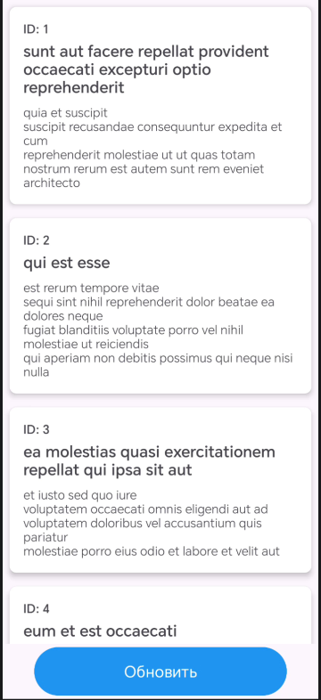

<div align="center">
    
МИНИСТЕРСТВО НАУКИ И ВЫСШЕГО ОБРАЗОВАНИЯ РОССИЙСКОЙ ФЕДЕРАЦИИ ФЕДЕРАЛЬНОЕ ГОСУДАРСТВЕННОЕ БЮДЖЕТНОЕ ОБРАЗОВАТЕЛЬНОЕ УЧРЕЖДЕНИЕ ВЫСШЕГО ОБРАЗОВАНИЯ
"САХАЛИНСКИЙ ГОСУДАРСТВЕННЫЙ УНИВЕРСИТЕТ»

<br><br><br><br>

Институт естественных наук и техносферной безопасности

Кафедра информатики

Лапырёнок Анастасия

<br><br><br><br>

Лабораторная работа №13

«Создание простого API клиента. Запрос списка постов с jsonplaceholder.typicode.com»

01.03.02 Прикладная математика и информатика

<br><br><br><br><br>

<div align="right">
Научный руководитель

Соболев Евгений Игоревич
</div>

<br><br><br><br><br>

г. Южно-Сахалинск
2026 г.

</div>

<br><br>

**Цель работы:** Научиться выполнять сетевые запросы в Android-приложении с использованием библиотеки Retrofit и корутин, обрабатывать ответы сервера, парсить JSON-данные и отображать их в RecyclerView.

<br><br>


## Листинг файла `Post.kt`

```kotlin
package com.example.postsapp.models

data class Post(
    val id: Int,
    val title: String,
    val body: String
)
```

<br><br>

## Листинг файла `ApiService.kt`

```kotlin
package com.example.postsapp.api

import com.example.postsapp.models.Post
import retrofit2.http.GET

interface ApiService {
    @GET("posts")
    suspend fun getPosts(): List<Post>
}
```

<br><br>

## Листинг файла `RetrofitClient.kt`

```kotlin
package com.example.postsapp.api

import retrofit2.Retrofit
import retrofit2.converter.gson.GsonConverterFactory

object RetrofitClient {
    private const val BASE_URL = "https://jsonplaceholder.typicode.com/"

    private val retrofit = Retrofit.Builder()
        .baseUrl(BASE_URL)
        .addConverterFactory(GsonConverterFactory.create())
        .build()

    val apiService: ApiService = retrofit.create(ApiService::class.java)
}
```

<br><br>

## Листинг файла `PostsRepository.kt`

```kotlin
package com.example.postsapp.repositories

import com.example.postsapp.api.RetrofitClient
import com.example.postsapp.models.Post
import kotlinx.coroutines.Dispatchers
import kotlinx.coroutines.withContext

class PostsRepository {
    private val apiService = RetrofitClient.apiService

    suspend fun getPosts(): List<Post> = withContext(Dispatchers.IO) {
        apiService.getPosts()
    }
}
```

<br><br>

## Листинг файла `PostsViewModel.kt`

```kotlin
package com.example.postsapp.viewmodels

import androidx.lifecycle.ViewModel
import androidx.lifecycle.viewModelScope
import com.example.postsapp.models.Post
import com.example.postsapp.repositories.PostsRepository
import kotlinx.coroutines.flow.MutableStateFlow
import kotlinx.coroutines.flow.StateFlow
import kotlinx.coroutines.flow.asStateFlow
import kotlinx.coroutines.launch

sealed class PostsUiState {
    object Loading : PostsUiState()
    data class Success(val posts: List<Post>) : PostsUiState()
    data class Error(val message: String) : PostsUiState()
}

class PostsViewModel : ViewModel() {
    private val repository = PostsRepository()

    private val _uiState = MutableStateFlow<PostsUiState>(PostsUiState.Loading)
    val uiState: StateFlow<PostsUiState> = _uiState.asStateFlow()

    init {
        loadPosts()
    }

    fun loadPosts() {
        viewModelScope.launch {
            _uiState.value = PostsUiState.Loading
            try {
                val posts = repository.getPosts()
                _uiState.value = PostsUiState.Success(posts)
            } catch (e: Exception) {
                _uiState.value = PostsUiState.Error(e.message ?: "Unknown error")
            }
        }
    }
}
```

<br><br>

## Листинг файла `PostsAdapter.kt`

```kotlin
package com.example.postsapp.adapters

import android.view.LayoutInflater
import android.view.ViewGroup
import androidx.recyclerview.widget.RecyclerView
import com.example.postsapp.databinding.ItemPostBinding
import com.example.postsapp.models.Post

class PostsAdapter(
    private val onItemClick: (Post) -> Unit
) : RecyclerView.Adapter<PostsAdapter.PostViewHolder>() {

    private var posts = emptyList<Post>()

    fun submitList(newPosts: List<Post>) {
        posts = newPosts
        notifyDataSetChanged()
    }

    override fun onCreateViewHolder(parent: ViewGroup, viewType: Int): PostViewHolder {
        val binding = ItemPostBinding.inflate(LayoutInflater.from(parent.context), parent, false)
        return PostViewHolder(binding)
    }

    override fun onBindViewHolder(holder: PostViewHolder, position: Int) {
        holder.bind(posts[position])
    }

    override fun getItemCount() = posts.size

    inner class PostViewHolder(private val binding: ItemPostBinding) :
        RecyclerView.ViewHolder(binding.root) {

        fun bind(post: Post) {
            binding.textPostId.text = "ID: ${post.id}"
            binding.textPostTitle.text = post.title
            binding.textPostBody.text = post.body

            // Обработчик клика
            itemView.setOnClickListener {
                onItemClick(post)
            }
        }
    }
}
```

<br><br>

## Листинг файла `MainActivity.kt`

```kotlin
package com.example.postsapp

import android.content.Intent
import android.os.Bundle
import android.widget.Button
import android.widget.ProgressBar
import android.widget.TextView
import androidx.activity.viewModels
import androidx.appcompat.app.AppCompatActivity
import androidx.lifecycle.Lifecycle
import androidx.lifecycle.lifecycleScope
import androidx.lifecycle.repeatOnLifecycle
import androidx.recyclerview.widget.LinearLayoutManager
import androidx.recyclerview.widget.RecyclerView
import com.example.postsapp.adapters.PostsAdapter
import com.example.postsapp.viewmodels.PostsUiState
import com.example.postsapp.viewmodels.PostsViewModel
import kotlinx.coroutines.launch

class MainActivity : AppCompatActivity() {

    private val viewModel: PostsViewModel by viewModels()
    private lateinit var adapter: PostsAdapter
    private lateinit var recyclerView: RecyclerView
    private lateinit var progressBar: ProgressBar
    private lateinit var textError: TextView
    private lateinit var buttonRefresh: Button

    override fun onCreate(savedInstanceState: Bundle?) {
        super.onCreate(savedInstanceState)
        setContentView(R.layout.activity_main)

        recyclerView = findViewById(R.id.recyclerViewPosts)
        progressBar = findViewById(R.id.progressBar)
        textError = findViewById(R.id.textError)
        buttonRefresh = findViewById(R.id.buttonRefresh)

        setupRecyclerView()
        observeUiState()

        buttonRefresh.setOnClickListener {
            viewModel.loadPosts()
        }
    }

    private fun setupRecyclerView() {
        adapter = PostsAdapter { post ->
            // При клике на элемент открываем новый экран
            val intent = Intent(this, PostDetailActivity::class.java)
            intent.putExtra("POST_ID", post.id)
            intent.putExtra("POST_TITLE", post.title)
            intent.putExtra("POST_BODY", post.body)
            startActivity(intent)
        }
        recyclerView.layoutManager = LinearLayoutManager(this)
        recyclerView.adapter = adapter
    }


    private fun observeUiState() {
        lifecycleScope.launch {
            repeatOnLifecycle(Lifecycle.State.STARTED) {
                viewModel.uiState.collect { state ->
                    when (state) {
                        is PostsUiState.Loading -> showLoading()
                        is PostsUiState.Success -> showPosts(state.posts)
                        is PostsUiState.Error -> showError(state.message)
                    }
                }
            }
        }
    }

    private fun showLoading() {
        recyclerView.visibility = android.view.View.GONE
        progressBar.visibility = android.view.View.VISIBLE
        textError.visibility = android.view.View.GONE
    }

    private fun showPosts(posts: List<com.example.postsapp.models.Post>) {
        recyclerView.visibility = android.view.View.VISIBLE
        progressBar.visibility = android.view.View.GONE
        textError.visibility = android.view.View.GONE
        adapter.submitList(posts)
    }

    private fun showError(message: String) {
        recyclerView.visibility = android.view.View.GONE
        progressBar.visibility = android.view.View.GONE
        textError.visibility = android.view.View.VISIBLE
        textError.text = "Ошибка: $message"
    }
}
```

<br><br>

## Листинг файла `PostDetailActivity.kt`

```kotlin
package com.example.postsapp

import android.os.Bundle
import android.widget.Button
import android.widget.TextView
import androidx.appcompat.app.AppCompatActivity

class PostDetailActivity : AppCompatActivity() {

    private lateinit var textPostDetailId: TextView
    private lateinit var textPostDetailTitle: TextView
    private lateinit var textPostDetailBody: TextView
    private lateinit var buttonBack: Button

    override fun onCreate(savedInstanceState: Bundle?) {
        super.onCreate(savedInstanceState)
        setContentView(R.layout.activity_post_detail)

        // Инициализация View
        textPostDetailId = findViewById(R.id.textPostDetailId)
        textPostDetailTitle = findViewById(R.id.textPostDetailTitle)
        textPostDetailBody = findViewById(R.id.textPostDetailBody)
        buttonBack = findViewById(R.id.buttonBack)

        // Получение данных из Intent
        val postId = intent.getIntExtra("POST_ID", -1)
        val postTitle = intent.getStringExtra("POST_TITLE") ?: "No title"
        val postBody = intent.getStringExtra("POST_BODY") ?: "No body"

        // Отображение данных
        textPostDetailId.text = "ID: $postId"
        textPostDetailTitle.text = postTitle
        textPostDetailBody.text = postBody

        // Обработчик кнопки «Назад»
        buttonBack.setOnClickListener {
            onBackPressed()
        }
    }
}
```

<br><br>

## Листинг файла `activity_main.xml`

```xml
<?xml version="1.0" encoding="utf-8"?>
<androidx.constraintlayout.widget.ConstraintLayout
    xmlns:android="http://schemas.android.com/apk/res/android"
    xmlns:app="http://schemas.android.com/apk/res-auto"
    android:layout_width="match_parent"
    android:layout_height="match_parent">

    <FrameLayout
        android:id="@+id/frameContent"
        android:layout_width="0dp"
        android:layout_height="0dp"
        app:layout_constraintTop_toTopOf="parent"
        app:layout_constraintBottom_toTopOf="@+id/buttonRefresh"
        app:layout_constraintStart_toStartOf="parent"
        app:layout_constraintEnd_toEndOf="parent">

        <!-- Ваш RecyclerView, ProgressBar и TextView Error -->
        <androidx.recyclerview.widget.RecyclerView
            android:id="@+id/recyclerViewPosts"
            android:layout_width="match_parent"
            android:layout_height="match_parent"
            android:visibility="gone"/>
        <ProgressBar
            android:id="@+id/progressBar"
            android:layout_width="wrap_content"
            android:layout_height="wrap_content"
            android:layout_gravity="center"
            android:visibility="gone"/>
        <TextView
            android:id="@+id/textError"
            android:layout_width="wrap_content"
            android:layout_height="wrap_content"
            android:layout_gravity="center"
            android:text="Ошибка загрузки"
            android:visibility="gone"/>
    </FrameLayout>

    <Button
        android:id="@+id/buttonRefresh"
        android:layout_width="0dp"
        android:layout_height="wrap_content"
        android:text="Обновить"
        android:paddingVertical="16dp"
        android:textSize="18sp"
        android:backgroundTint="#2196F3"
        android:textColor="@android:color/white"
        app:layout_constraintBottom_toBottomOf="parent"
        app:layout_constraintStart_toStartOf="parent"
        app:layout_constraintEnd_toEndOf="parent"
        app:layout_constraintWidth_percent="0.8" />
</androidx.constraintlayout.widget.ConstraintLayout>
```

<br><br>

## Листинг файла `item_post.xml`

```xml
<?xml version="1.0" encoding="utf-8"?>
<androidx.cardview.widget.CardView
    xmlns:android="http://schemas.android.com/apk/res/android"
    xmlns:app="http://schemas.android.com/apk/res-auto"
    android:layout_width="match_parent"
    android:layout_height="wrap_content"
    android:layout_margin="8dp"
    app:cardCornerRadius="8dp"
    app:cardElevation="4dp">

    <LinearLayout
        android:layout_width="match_parent"
        android:layout_height="wrap_content"
        android:orientation="vertical"
        android:padding="16dp">

        <TextView
            android:id="@+id/textPostId"
            android:layout_width="wrap_content"
            android:layout_height="wrap_content"
            android:text="ID: "
            android:textStyle="bold"
            android:textSize="14sp"/>

        <TextView
            android:id="@+id/textPostTitle"
            android:layout_width="wrap_content"
            android:layout_height="wrap_content"
            android:text="Title"
            android:textSize="18sp"
            android:textStyle="bold"
            android:layout_marginTop="4dp"/>

        <TextView
            android:id="@+id/textPostBody"
            android:layout_width="wrap_content"
            android:layout_height="wrap_content"
            android:text="Body"
            android:textSize="14sp"
            android:layout_marginTop="8dp"/>

    </LinearLayout>
</androidx.cardview.widget.CardView>
```

<br><br>

## Листинг файла `activity_post_detail.xml`

```xml
<?xml version="1.0" encoding="utf-8"?>
<androidx.constraintlayout.widget.ConstraintLayout
    xmlns:android="http://schemas.android.com/apk/res/android"
    xmlns:app="http://schemas.android.com/apk/res-auto"
    android:layout_width="match_parent"
    android:layout_height="match_parent"
    android:padding="16dp">

    <ScrollView
        android:id="@+id/scrollView"
        android:layout_width="0dp"
        android:layout_height="0dp"
        app:layout_constraintTop_toTopOf="parent"
        app:layout_constraintBottom_toTopOf="@+id/buttonBack"
        app:layout_constraintStart_toStartOf="parent"
        app:layout_constraintEnd_toEndOf="parent">

        <LinearLayout
            android:layout_width="match_parent"
            android:layout_height="wrap_content"
            android:orientation="vertical">

            <TextView
                android:id="@+id/textPostDetailId"
                android:layout_width="wrap_content"
                android:layout_height="wrap_content"
                android:text="ID: "
                android:textStyle="bold"
                android:textSize="16sp" />

            <TextView
                android:id="@+id/textPostDetailTitle"
                android:layout_width="wrap_content"
                android:layout_height="wrap_content"
                android:text="Title"
                android:textSize="20sp"
                android:textStyle="bold"
                android:layout_marginTop="8dp" />

            <TextView
                android:id="@+id/textPostDetailBody"
                android:layout_width="wrap_content"
                android:layout_height="wrap_content"
                android:text="Body"
                android:textSize="14sp"
                android:layout_marginTop="16dp" />
        </LinearLayout>
    </ScrollView>

    <Button
        android:id="@+id/buttonBack"
        android:layout_width="0dp"
        android:layout_height="wrap_content"
        android:text="Назад"
        android:paddingVertical="16dp"
        android:textSize="18sp"
        android:backgroundTint="#6200EE"
        android:textColor="@android:color/white"
        app:layout_constraintBottom_toBottomOf="parent"
        app:layout_constraintStart_toStartOf="parent"
        app:layout_constraintEnd_toEndOf="parent"
        app:layout_constraintWidth_percent="0.8" />
</androidx.constraintlayout.widget.ConstraintLayout>
```

<br><br>

## Скриншот приложения с отображением результатов


<br><br>

## Ответы на контрольные вопросы:

### 1. Для чего используется библиотека Retrofit? Какие аннотации вы знаете?

**Retrofit** — это типобезопасная HTTP‑библиотека для Android и Java, упрощающая выполнение сетевых запросов. Она преобразует HTTP API в интерфейс Java/Kotlin.

**Основные задачи Retrofit:**
* автоматическая сериализация/десериализация JSON (с помощью конвертеров, например, Gson);
* построение HTTP‑запросов на основе аннотаций;
* интеграция с корутинами Kotlin или RxJava для асинхронных операций;
* поддержка различных HTTP‑методов и параметров.

**Популярные аннотации Retrofit:**

* `@GET`, `@POST`, `@PUT`, `@DELETE`, `@PATCH` — определяют HTTP‑метод запроса;
* `@Headers` — добавляют HTTP‑заголовки к запросу;
* `@Header` — динамически задают заголовок (значение передаётся как параметр метода);
* `@Query` — добавляют параметры запроса в URL (например, `?page=1&size=10`);
* `@Path` — подставляют значения в шаблон URL (например, `/users/{id}`);
* `@Body` — указывают объект, который будет сериализован в тело запроса (обычно для POST/PUT);
* `@FormUrlEncoded` — отмечают метод для отправки данных в формате `application/x-www-form-urlencoded`;
* `@Field` — задают поля формы (используется вместе с `@FormUrlEncoded`);
* `@Multipart` — отмечают метод для загрузки файлов;
* `@Part` — задают части многокомпонентного запроса (файлы или данные).

---

### 2. Почему сетевые запросы нельзя выполнять в главном потоке?

Главный поток (UI‑поток) отвечает за отрисовку интерфейса и обработку взаимодействий пользователя. Выполнение сетевых запросов в нём приводит к следующим проблемам:

* **ANR (Application Not Responding)**. Если поток занят ожиданием ответа от сервера дольше 5 секунд, система показывает диалоговое окно «Приложение не отвечает», предлагая закрыть приложение.
* **Зависание интерфейса**. Пока запрос не завершится, интерфейс не реагирует на касания, скроллинг и другие действия. Кнопки не нажимаются, анимации замирают.
* **Плохой пользовательский опыт**. Даже если запрос выполняется быстро, любое заметное «подвисание» воспринимается негативно.

**Решение:** сетевые запросы выполняются в фоновых потоках (с помощью корутин, RxJava, `AsyncTask` (устарел) и т. д.).

---

### 3. Что такое suspend‑функция и как она работает с корутинами?

**Suspend‑функция** — это функция в Kotlin, которая может приостанавливать своё выполнение без блокировки потока, а затем возобновлять его позже. Она может вызываться только из корутины или другой suspend‑функции.

**Ключевые особенности:**
* не блокирует поток во время приостановки;
* может приостанавливаться и возобновляться в разных потоках;
* компилятор Kotlin преобразует её в конечный автомат с механизмом продолжения (`continuation`).

**Работа с корутинами:**
1. Корутина запускается в определённом контексте (например, в `Dispatchers.Main` для UI).
2. При вызове suspend‑функции корутина приостанавливается, освобождая поток для других задач.
3. После завершения асинхронной операции (например, сетевого запроса) корутина возобновляется.
4. Возобновление может произойти в том же или другом потоке — это зависит от диспетчера корутин.

**Пример:**
```kotlin
suspend fun fetchData(): String {
    delay(1000) // имитация сетевого запроса
    return "Data from network"
}

lifecycleScope.launch { // запуск корутины
    val result = fetchData() // приостановка без блокировки UI
    textView.text = result // возобновление в UI‑потоке
}
```

---

### 4. Для чего нужен Dispatchers.IO?

`Dispatchers.IO` — это диспетчер корутин в Kotlin, оптимизированный для операций ввода‑вывода (I/O), которые:
* занимают много времени;
* не требуют интенсивной работы процессора;
* часто блокируют поток (ожидание ответа от сети, чтение/запись файла и т. п.).

**Особенности `Dispatchers.IO`:**
* использует пул потоков (обычно до 64), который может расти по мере необходимости;
* подходит для сетевых запросов, работы с файлами, базами данных;
* позволяет эффективно выполнять множество параллельных I/O‑операций без создания новых потоков для каждой.

**Когда использовать:**
* выполнение HTTP‑запросов через Retrofit;
* чтение/запись файлов;
* операции с базой данных Room;
* любые длительные операции, связанные с ожиданием внешних ресурсов.

**Пример использования:**
```kotlin
lifecycleScope.launch(Dispatchers.IO) {
    val data = apiService.fetchUserData() // сетевой запрос в фоновом потоке
    withContext(Dispatchers.Main) { // переключение обратно в UI
        updateUI(data)
    }
}
```

---

### 5. Как обрабатывать ошибки при сетевых запросах?

Обработка ошибок при сетевых запросах должна быть комплексной. Основные подходы:

**1. Try‑catch блоки** (для корутин):
```kotlin
lifecycleScope.launch {
    try {
        val response = apiService.getData()
        handleSuccess(response)
    } catch (e: IOException) {
        // Нет сети, таймаут
        showNetworkError()
    } catch (e: HttpException) {
        // Ошибка HTTP (4xx, 5xx)
        showHttpError(e.code())
    } catch (e: Exception) {
        // Другие ошибки
        showGenericError()
    }
}
```

**2. Проверка кода ответа** (если Retrofit возвращает `Response<T>`):
```kotlin
val response = apiService.getDataCall()
if (response.isSuccessful) {
    handleSuccess(response.body())
} else {
    showError(response.code(), response.errorBody())
}
```

**3. Кастомные Result‑классы** для единообразной обработки:
```kotlin
sealed class NetworkResult<out T> {
    data class Success<T>(val data: T) : NetworkResult<T>()
    data class Error(val message: String) : NetworkResult<Nothing>()
}

// В сервисе Retrofit: suspend fun getData(): NetworkResult<Data>
```

**4. Интерцепторы Retrofit** для глобальной обработки ошибок (аутентификация, логирование).

**5. Повторные попытки (retry)** с помощью корутин:
```kotlin
private suspend fun <T> withRetry(attempts: Int, block: suspend () -> T): T {
    var lastException: Exception? = null
    repeat(attempts) {
        try {
            return block()
        } catch (e: Exception) {
            lastException = e
            delay(1000) // ожидание перед повторной попыткой
        }
    }
    throw lastException!!
}
```

**Типичные ошибки:**
* `IOException` — проблемы сети (нет подключения, таймаут);
* `HttpException` — HTTP‑ошибки (404, 500 и т. д.);
* ошибки сериализации (некорректный JSON);
* ошибки аутентификации (401, 403).

---

### 6. Что такое JSONPlaceholder и для чего он используется?

**JSONPlaceholder** — это бесплатный онлайн‑сервис, предоставляющий фейковое RESTful API для тестирования и прототипирования. Он возвращает данные в формате JSON.

**Для чего используется:**
* **Обучение и демонстрация.** Идеален для примеров по работе с Retrofit, корутинами, RecyclerView.
* **Прототипирование.** Позволяет начать разработку интерфейса, пока бэкенд ещё не готов.
* **Тестирование.** Используется для проверки логики приложения, обработки ошибок, отображения данных.
* **Демонстрация API.** Разработчики могут показать, как будет выглядеть их API, не создавая серверную часть.

**Что предоставляет:**
* ресурсы: `/posts`, `/comments`, `/users`, `/albums`, `/photos` и др.;
* стандартные HTTP‑методы: GET, POST, PUT, PATCH, DELETE;
* реалистичные данные (посты, комментарии, пользователи);
* имитацию задержек ответов (чтобы тестировать UI во время загрузки).

**Пример запроса:**
* GET `https://jsonplaceholder.typicode.com/posts` — возвращает список из 100 фейковых постов;
* POST `https://jsonplaceholder.typicode.com/posts` — создаёт новый пост (данные сохраняются только в рамках сессии).

**Преимущества:**
* не требует регистрации или API‑ключей;
* всегда доступен;
* поддерживает CORS;
* полностью бесплатен.

## Вывод

В ходе работы успешно реализована функциональность выполнения сетевых запросов в Android‑приложении с применением **Retrofit** и **корутин Kotlin**. Достигнуты все поставленные цели:

1. **Сетевые запросы и обработка ответов.** Приложение получает данные с сервера через Retrofit, используя suspend‑функции и корутины — это позволяет не блокировать главный поток. Для взаимодействия с API задействован бесплатный тестовый сервис **JSONPlaceholder**.

2. **Парсинг JSON.** Автоматическая десериализация JSON‑данных в объекты Kotlin (`Post`) выполняется с помощью конвертера **Gson** в составе Retrofit.

3. **Отображение данных.** Полученные данные отображаются в интерфейсе через **RecyclerView** с кастомным адаптером (`PostsAdapter`). Для каждого элемента списка предусмотрена навигация к детальному экрану (`PostDetailActivity`).

4. **Управление состоянием UI.** Состояние интерфейса (загрузка, успех, ошибка) централизованно управляется через `StateFlow` в `PostsViewModel` с использованием sealed‑класса `PostsUiState`. Это обеспечивает чёткое разделение логики и представления.

5. **Асинхронность и безопасность потоков.** Сетевые операции выполняются в фоновом потоке с помощью `Dispatchers.IO`, а обновления UI — в главном потоке через `viewModelScope`. Это исключает зависания интерфейса и ANR‑ошибки.

6. **Обработка ошибок.** Реализована обработка исключений (например, `IOException`, `HttpException`) в `ViewModel`, что позволяет корректно отображать сообщения об ошибках пользователю.

7. **Архитектура.** Проект следует принципам современной Android‑разработки:
    * разделение ответственности (Repository, ViewModel, View);
    * использование lifecycle‑aware компонентов;
    * реактивный подход к обновлению UI через `StateFlow`.

---

**Итог:** разработанное приложение демонстрирует грамотное применение современных инструментов Android‑разработки для работы с сетевыми данными. Код структурирован, тестируем и готов к расширению (например, добавлением кэширования, авторизации или новых API‑эндпоинтов).