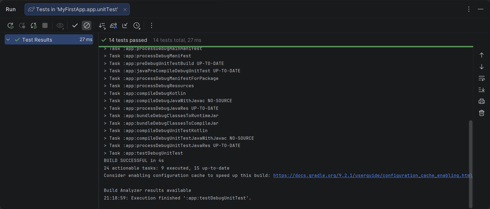

<div align="center">
    
МИНИСТЕРСТВО НАУКИ И ВЫСШЕГО ОБРАЗОВАНИЯ РОССИЙСКОЙ ФЕДЕРАЦИИ ФЕДЕРАЛЬНОЕ ГОСУДАРСТВЕННОЕ БЮДЖЕТНОЕ ОБРАЗОВАТЕЛЬНОЕ УЧРЕЖДЕНИЕ ВЫСШЕГО ОБРАЗОВАНИЯ
"САХАЛИНСКИЙ ГОСУДАРСТВЕННЫЙ УНИВЕРСИТЕТ»

<br><br><br><br>

Институт естественных наук и техносферной безопасности

Кафедра информатики

Лапырёнок Анастасия

<br><br><br><br>

Лабораторная работа № 2

«Написание консольных утилит на Kotlin внутри Android проекта. Расчеты, работа со строками. Подготовка классов данных для будущего приложения»

01.03.02 Прикладная математика и информатика

<br><br><br><br><br>

<div align="right">
Научный руководитель

Соболев Евгений Игоревич
</div>

<br><br><br><br><br>

г. Южно-Сахалинск
2026 г.

</div>

<br><br>

**Цель работы:** Научиться создавать классы данных и функции-утилиты на Kotlin в контексте Android-проекта, освоить базовые приёмы работы со строками и числами, познакомиться с юнит-тестированием для проверки корректности кода.

<br><br>


## Листинг файла `Book.kt`

```kotlin
package com.example.myfirstapp.utils
//package com.example.myfirstapp.utils - указывает расположение класса в структуре проекта (пакет),
//следует общепринятой конвенции именования пакетов: домен в обратном порядке (com.example) + название приложения (myfirstapp) + модуль/категория (utils).
//Позволяет организовать код, избежать конфликтов имён и упростить импорт в других файлах.

//data class — специальный тип класса в Kotlin, предназначенный для хранения данных. Компилятор автоматически генерирует ряд стандартных методов на основе свойств класса.
 class Book(
    val title: String,
    val author: String,
    val year: Int,
    val price: Double
)
//Все свойства объявлены с ключевым словом val — это означает, что они неизменяемые (read‑only). После инициализации их значение нельзя изменить.
//Перечислены четыре свойства:
//title: String — название книги, тип String (строка);
//author: String — автор книги, тип String;
//year: Int — год издания, тип Int (целое число);
//price: Double — цена книги, тип Double (число с плавающей точкой).
```

<br><br>

## Листинг файла `Student.kt`

```kotlin
package com.example.myfirstapp.utils
//package com.example.myfirstapp.utils - указывает расположение файла в структуре проекта (пакет). 

//Объявление data‑класса Student в Kotlin.
data class Student(
    val name: String,
    val surname: String,
    val group: String,
    val mark: Int
)
//Все свойства объявлены с ключевым словом val — это означает, что они неизменяемые (read‑only): после инициализации их значение нельзя изменить.
//Перечислены четыре свойства:
//name: String — имя студента, тип String (строка);
//surname: String — фамилия студента, тип String;
//group: String — номер группы студента, тип String;
//mark: Int — средняя оценка студента, тип Int (целое число).
```

<br><br>


## Листинг файла `StringUtils.kt`

```kotlin
package com.example.myfirstapp.utils //package com.example.myfirstapp.utils - указывает расположение файла в структуре проекта (пакет). 

// Проверка, что строка похожа на email (содержит @ и .)
fun String.isValidEmail(): Boolean {
    return this.contains("@") && this.contains(".")
}
//Тип: fun String.isValidEmail(): Boolean — расширение для String, возвращает Boolean.
//Логика: проверяет наличие символов @ и . в строке через contains()


// Форматирование автора: "Толстой Л.Н."
fun formatAuthorName(fullName: String): String {
    val parts = fullName.split(" ").filter { it.isNotBlank() }
    return when (parts.size) {
        1 -> parts[0]  // только фамилия
        2 -> "${parts[0]} ${parts[1].first()}."  // фамилия и инициал
        3 -> "${parts[0]} ${parts[1].first()}.${parts[2].first()}."  // фамилия и два инициала
        else -> fullName
    }
}
//Вход: fullName: String — полное имя (например, «Лев Николаевич Толстой»).
//Обработка: разбивает строку на части по пробелам: split(" "); фильтрует пустые строки: filter { it.isNotBlank() }.
//Форматирование по количеству частей:
//1 часть → возвращает фамилию без изменений;
//2 части → фамилия + инициал имени («Толстой Л.»);
//3 части → фамилия + инициалы имени и отчества («Толстой Л.Н.»);
//иное → возвращает исходную строку.


// Применение скидки к цене книги
fun applyDiscount(price: Double, discountPercent: Double): Double {
    require(discountPercent in 0.0..100.0) { "Скидка должна быть от 0 до 100" }
    return price * (1 - discountPercent / 100)
}
//Входы: price: Double — исходная цена; discountPercent: Double — размер скидки в процентах.
//Валидация: require(discountPercent in 0.0..100.0) — проверяет, что скидка в диапазоне 0,0..100,0. При нарушении выбрасывает исключение с сообщением.
//Расчёт: price * (1 - discountPercent / 100) — вычисляет итоговую цену после скидки.
//Возврат: Double — новая цена.


//Возвращает строку с информацией о студенте в формате «Фамилия И. (группа X)»:
fun Student.getStudent(): String {
    return this.surname + " " + this.name.first() + ". (группа " + this.group + ")"
}
//Тип: расширяющая функция для класса Student


//Определяет статус студента по средней оценке:
fun Student.getStatus(): String {
    return when (this.mark) {
        5 -> "Отличник"
        4 -> "Хорошист"
        3 -> "Троечник"
        else -> ""
    }
}
//Тип: расширяющая функция для класса Student.
//Логика через when:
//оценка 5 → «Отличник»;
//оценка 4 → «Хорошист»;
//оценка 3 → «Троечник»;
//остальные значения → пустая строка.
```

<br><br>


## Листинг файла `StringUtilsTest.kt`

```kotlin

package com.example.myfirstapp.utils //указывает расположение файла в структуре проекта (пакет)


import androidx.core.widget.TextViewCompat //используется для обратной совместимости с функциями TextView
import org.junit.Assert.* //импортирует методы для проверок в тестах (assertEquals, assertTrue и т. д.);
import org.junit.Test //предоставляет аннотацию @Test для обозначения тестовых методов.


//Содержит набор юнит‑тестов для проверки функций из StringUtils.kt. Каждый метод тестирует отдельную функцию или сценарий.
class StringUtilsTest {

    // Аннотации @Test — отмечают методы как тестовые.
    @Test
    fun emailValidation_correct() {
        assertTrue("test@example.com".isValidEmail())
        assertTrue("user.name@domain.co".isValidEmail())
    } //проверяет, что корректные email‑адреса проходят проверку

    @Test
    fun emailValidation_incorrect() {
        assertFalse("testexample.com".isValidEmail())
        assertFalse("test@example".isValidEmail())
        assertFalse("".isValidEmail())
    } //проверяет, что некорректные строки не проходят проверку

    @Test
    fun formatAuthorName_fullName() {
        assertEquals("Толстой Л.Н.", formatAuthorName("Толстой Лев Николаевич"))
        assertEquals("Пушкин А.С.", formatAuthorName("Пушкин Александр Сергеевич"))
    } //тестирует форматирование полного имени (3 части):

    @Test
    fun formatAuthorName_twoParts() {
        assertEquals("Толстой Л.", formatAuthorName("Толстой Лев"))
        assertEquals("Пушкин А.", formatAuthorName("Пушкин Александр"))
    } //тестирует форматирование полного имени (2 части):

    @Test
    fun formatAuthorName_onePart() {
        assertEquals("Толстой", formatAuthorName("Толстой"))
    } тестирует форматирование полного имени (1 части):

    @Test
    fun applyDiscount_normal() {
        assertEquals(90.0, applyDiscount(100.0, 10.0), 0.001)
        assertEquals(75.0, applyDiscount(150.0, 50.0), 0.001)
    }//стандартные случаи со скидкой
//Точность сравнения чисел — в assertEquals для Double указывается дельта (0,001) для учёта погрешностей вычислений с плавающей точкой.

    @Test
    fun applyDiscount_zero() {
        assertEquals(100.0, applyDiscount(100.0, 0.0), 0.001)
    } //скидка 0%, цена не меняется

    @Test(expected = IllegalArgumentException::class) //Проверка исключений — через параметр expected в @Test тестируются сценарии с некорректными данными.
    fun applyDiscount_invalidLow() {
        applyDiscount(100.0, -5.0)
    } //отрицательная скидка (−5%) должна вызвать IllegalArgumentException

    @Test(expected = IllegalArgumentException::class)
    fun applyDiscount_invalidHigh() {
        applyDiscount(100.0, 110.0)
    } //скидка больше 100% (110%) должна вызвать IllegalArgumentException.


    //тесты для нового класса Student
    @Test
    fun getStudent_correct(){
        val student = Student("Иван", "Иванов","ПИ-101", 5)
        assertEquals("Иванов И. (группа ПИ-101)", student.getStudent())
    } //проверка формата вывода информации о студенте

    @Test
    fun getStatus_five(){
        val student = Student("Иван", "Иванов","ПИ-101", 5)
        assertEquals("Отличник", student.getStatus())
    } //оценка 5 → «Отличник».

    @Test
    fun getStatus_four(){
        val student = Student("Иван", "Иванов","ПИ-101", 4)
        assertEquals("Хорошист", student.getStatus())
    } //оценка 4 → «Хорошист».

    @Test
    fun getStatus_three(){
        val student = Student("Иван", "Иванов","ПИ-101", 3)
        assertEquals("Троечник", student.getStatus())
    } //оценка 3 → «Троечник».
}
```

<br><br>

### Скриншот успешного выполнения тестов


<br><br>

### Скриншот приложения с отображением результатов


<br><br>

### Ответы на контрольные вопросы:

**1. `data class`** в Kotlin предназначен для удобного хранения данных — он автоматически генерирует ряд стандартных методов на основе объявленных свойств.

**Автоматически генерируемые методы:**
   - `equals()` — сравнивает объекты на равенство;
   - `hashCode()` — создаёт хеш‑код объекта;
   - `toString()` — возвращает строковое представление объекта в формате `ClassName(prop1=value1, prop2=value2)`;
   - `copy()` — позволяет создать копию объекта с изменением отдельных свойств;
   - компоненты (`component1()`, `component2()` и т. д.) — поддерживают деструктуризацию.

<br>

**2. Функция расширения** добавляет новую функциональность к существующему классу без изменения его исходного кода.
   - Синтаксис объявления: `fun Тип.имяФункции()`
   - Способ вызова: Как метод объекта: `"текст".myFunc()`
   - Доступ к членам класса: Имеет доступ к `public`‑членам через `this` 
   - Область применения: Добавляет функциональность существующим классам
   - Ограничения: Не может обращаться к `private`‑членам класса

<br>

**3. Способы запуска:**

    1. Запуск отдельного теста или класса:
       - откройте файл с тестами (`*Test.kt`);
       - щёлкните правой кнопкой мыши на методе теста или названии класса;
       - выберите *Run «ИмяТеста»* или *Run «ИмяКласса»*;
       - либо используйте сочетание клавиш `Ctrl+Shift+F10`.

    2. Через конфигурацию запуска:
       - перейдите в *Run → Edit Configurations*;
       - создайте новую конфигурацию типа *JUnit*;
       - укажите класс/пакет для запуска;
       - нажмите кнопку *Run* (зелёная стрелка).

    3. Через Gradle:
       - откройте вкладку *Gradle* (справа в интерфейсе);
       - разверните *Tasks → verification*;
       - дважды кликните на задачу `test`;
       - либо выполните в терминале: `./gradlew test`.

    4. Запуск всей тестовой группы:
       - в окне *Project* выделите папку с тестами;
       - щёлкните правой кнопкой → *Run tests in «папка»*;
       - или используйте *Run All* в панели запуска.

**Результаты выполнения:**
   - зелёные галочки — тесты пройдены;
   - красные крестики — тесты упали (отображается стек вызовов ошибки);
   - вкладка *Run* показывает детали выполнения.

<br>

**4. `assertEquals`** — метод из библиотеки JUnit для проверки равенства ожидаемого и фактического значений. Если значения не совпадают, тест завершается ошибкой.

**Синтаксис:**
```kotlin
assertEquals(expected, actual)                    // для целых чисел
assertEquals(expected, actual, delta)        // для вещественных чисел
```
**Третий параметр (дельта)** задаёт максимально допустимую разницу между числами для признания их равными. Он нужен из‑за особенностей арифметики с плавающей точкой.

**Почему возникает погрешность:**
* числа с плавающей точкой (`Float`, `Double`) хранятся в двоичном формате, который не всегда точно представляет десятичные дроби;
* операции сложения/вычитания могут накапливать небольшие ошибки округления;
* прямое сравнение через `==` может дать `false` даже для «одинаковых» значений.

**Пример проблемы:**
```kotlin
println(0.1 + 0.2 == 0.3)  // false!
println(0.1 + 0.2)          // 0.30000000000000004
```

**Решение с дельтой:**
```kotlin
assertEquals(0.3, 0.1 + 0.2, 0.001)  // true — разница < 0.001
```

<br>

**5. Тесты, выполняющиеся на JVM (локальные юнит‑тесты)**, хранятся в директории:
```
app/src/test/kotlin/com/example/mypackage/
```
или
```
app/src/test/java/com/example/mypackage/
```

**Структура пути:**
* `app/` — модуль приложения;
* `src/` — корневая папка исходных файлов;
* `test/` — папка для JVM‑тестов (не требуют Android‑окружения);
* `kotlin/` или `java/` — язык реализации;
* `com/example/...` — пакет, соответствующий структуре основного кода.

**Отличие от Android‑тестов:**
* **JVM‑тесты (`test/`)** — запускаются на локальной JVM, быстрые, тестируют бизнес‑логику, утилиты;
* **Android‑тесты (`androidTest/`)** — требуют эмулятора/устройства, тестируют UI, компоненты Android.

**Вывод:** Научилась создавать классы данных и функции-утилиты на Kotlin в контексте Android-проекта, освоила базовые приёмы работы со строками и числами, познакомилась с юнит-тестированием для проверки корректности кода.