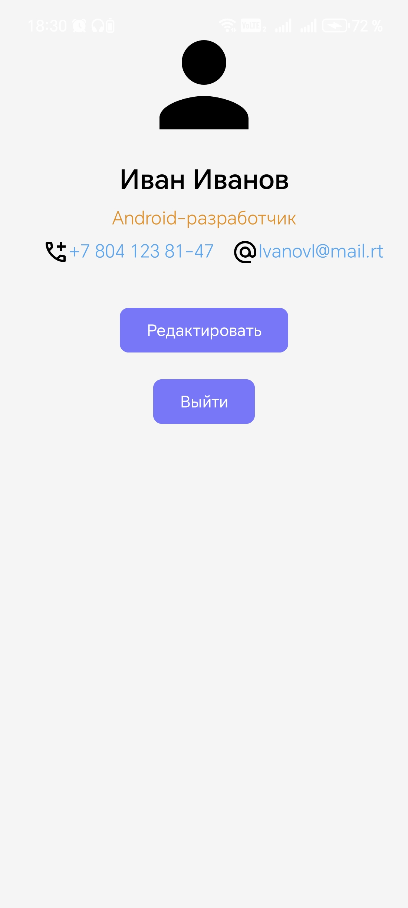

<div align="center">
    
МИНИСТЕРСТВО НАУКИ И ВЫСШЕГО ОБРАЗОВАНИЯ РОССИЙСКОЙ ФЕДЕРАЦИИ ФЕДЕРАЛЬНОЕ ГОСУДАРСТВЕННОЕ БЮДЖЕТНОЕ ОБРАЗОВАТЕЛЬНОЕ УЧРЕЖДЕНИЕ ВЫСШЕГО ОБРАЗОВАНИЯ
"САХАЛИНСКИЙ ГОСУДАРСТВЕННЫЙ УНИВЕРСИТЕТ»

<br><br><br><br>

Институт естественных наук и техносферной безопасности

Кафедра информатики

Лапырёнок Анастасия

<br><br><br><br>

Лабораторная работа №4

«Верстка экрана профиля пользователя (аватар, имя, кнопка «Редактировать»)»

01.03.02 Прикладная математика и информатика

<br><br><br><br><br>

<div align="right">
Научный руководитель

Соболев Евгений Игоревич
</div>

<br><br><br><br><br>

г. Южно-Сахалинск
2026 г.

</div>

<br><br>

**Цель работы:** Освоить создание пользовательского интерфейса в Android с использованием ConstraintLayout, изучить основные компоненты: ImageView, TextView, Button. Научиться работать с ресурсами (строки, цвета, размеры) и обрабатывать нажатия кнопок.

<br><br>


## Листинг файла `activity_main.xml`

```kotlin
<?xml version="1.0" encoding="utf-8"?>
<!-- Объявление XML-документа с указанием версии и кодировки -->

<!-- Корневой контейнер — ConstraintLayout, обеспечивающий гибкое позиционирование элементов через привязки -->
<androidx.constraintlayout.widget.ConstraintLayout
    xmlns:android="http://schemas.android.com/apk/res/android"
    xmlns:app="http://schemas.android.com/apk/res-auto"
    xmlns:tools="http://schemas.android.com/tools"
    android:layout_width="match_parent"  <!-- Ширина контейнера занимает всю доступную ширину родителя -->
    android:layout_height="match_parent" <!-- Высота контейнера занимает всю доступную высоту родителя -->
    android:background="@color/gray_light" <!-- Фон контейнера — светло‑серый цвет -->
    tools:context=".MainActivity"> <!-- Указывает, что этот layout связан с MainActivity -->

    <!-- Аватар пользователя -->
    <ImageView
        android:id="@+id/imageAvatar" <!-- Уникальный идентификатор элемента -->
        android:layout_width="@dimen/avatar_size" <!-- Ширина задаётся через ресурс dimen -->
        android:layout_height="@dimen/avatar_size" <!-- Высота задаётся через ресурс dimen -->
        android:src="@drawable/ic_profile" <!-- Изображение для отображения -->
        app:layout_constraintTop_toTopOf="parent" <!-- Привязка к верхнему краю родителя -->
        app:layout_constraintBottom_toTopOf="@+id/textName" <!-- Привязка нижнего края к верху TextView с именем -->
        app:layout_constraintLeft_toLeftOf="parent" <!-- Привязка левого края к левому краю родителя -->
        app:layout_constraintRight_toRightOf="parent" <!-- Привязка правого края к правому краю родителя -->
        android:layout_marginTop="@dimen/margin_normal" <!-- Отступ сверху -->
        android:contentDescription="@string/profile_name" /> <!-- Описание для доступности -->

    <!-- Имя пользователя -->
    <TextView
        android:id="@+id/textName" <!-- Уникальный идентификатор элемента -->
        android:layout_width="wrap_content" <!-- Ширина подстраивается под содержимое -->
        android:layout_height="wrap_content" <!-- Высота подстраивается под содержимое -->
        android:text="@string/profile_name" <!-- Текст задаётся через строковый ресурс -->
        android:textSize="@dimen/text_size_name" <!-- Размер текста задаётся через ресурс dimen -->
        android:textColor="@color/black" <!-- Цвет текста — чёрный -->
        android:textStyle="bold" <!-- Жирное начертание текста -->
        app:layout_constraintTop_toBottomOf="@id/imageAvatar" <!-- Привязка к низу ImageView с аватаром -->
        app:layout_constraintLeft_toLeftOf="parent" <!-- Привязка левого края к левому краю родителя -->
        app:layout_constraintRight_toRightOf="parent" <!-- Привязка правого края к правому краю родителя -->
        android:layout_marginTop="@dimen/margin_small" /> <!-- Небольшой отступ сверху -->

    <!-- Статус пользователя -->
    <TextView
        android:id="@+id/textStatus" <!-- Уникальный идентификатор элемента -->
        android:layout_width="wrap_content"
        android:layout_height="wrap_content"
        android:text="@string/profile_status" <!-- Текст статуса из строкового ресурса -->
        android:textSize="@dimen/text_size_status" <!-- Размер текста статуса -->
        android:textColor="@color/orange" <!-- Цвет текста — оранжевый -->
        app:layout_constraintTop_toBottomOf="@id/textName" <!-- Привязка к низу TextView с именем -->
        app:layout_constraintLeft_toLeftOf="parent"
        app:layout_constraintRight_toRightOf="parent"
        android:layout_marginTop="@dimen/margin_small" />

    <!-- Контейнер для контактной информации (телефон и email) -->
    <LinearLayout
        android:id="@+id/LinearLayout"
        android:layout_width="wrap_content"
        android:layout_height="50dp" <!-- Фиксированная высота контейнера -->
        android:orientation="horizontal" <!-- Горизонтальное расположение дочерних элементов -->
        android:paddingLeft="16dp" <!-- Отступы слева -->
        android:paddingRight="16dp" <!-- Отступы справа -->
        app:layout_constraintHorizontal_bias="0.5" <!-- Центрирование по горизонтали -->
        app:layout_constraintLeft_toLeftOf="parent"
        app:layout_constraintRight_toRightOf="parent"
        app:layout_constraintTop_toBottomOf="@id/textStatus"> <!-- Привязка к низу TextView со статусом -->

        <!-- Номер телефона -->
        <TextView
            android:id="@+id/textPhone"
            android:layout_width="wrap_content"
            android:layout_height="wrap_content"
            android:layout_marginTop="@dimen/margin_small"
            android:layout_marginStart="@dimen/margin_normal"
            android:text="@string/profile_phone" <!-- Текст телефона из строкового ресурса -->
            android:textColor="@color/blue_light_2" <!-- Цвет текста — светло‑синий -->
            android:textSize="@dimen/text_size_status"
            app:layout_constraintLeft_toLeftOf="parent"
            app:layout_constraintRight_toRightOf="parent"/>

        <!-- Email пользователя -->
        <TextView
            android:id="@+id/textEmail"
            android:layout_width="wrap_content"
            android:layout_height="wrap_content"
            android:layout_marginTop="@dimen/margin_small"
            android:layout_marginStart="@dimen/margin_normal"
            android:text="@string/profile_email" <!-- Текст email из строкового ресурса -->
            android:textColor="@color/blue_light_2"
            android:textSize="@dimen/text_size_status"
            app:layout_constraintLeft_toLeftOf="@+id/textPhone" <!-- Привязка к левому краю TextView с телефоном -->
            app:layout_constraintRight_toRightOf="parent"/>
    </LinearLayout>

    <!-- Кнопка «Редактировать» -->
    <Button
        android:id="@+id/buttonEdit"
        android:layout_width="wrap_content"
        android:layout_height="wrap_content"
        android:text="@string/button_edit" <!-- Текст кнопки из строкового ресурса -->
        android:backgroundTint="@color/blue_light" <!-- Цвет фона кнопки — светло‑синий -->
        app:cornerRadius="@dimen/button_corner_radius" <!-- Радиус скругления углов кнопки -->
        app:layout_constraintTop_toBottomOf="@+id/LinearLayout" <!-- Привязка к низу LinearLayout с контактами -->
        app:layout_constraintLeft_toLeftOf="parent"
        app:layout_constraintRight_toRightOf="parent"
        android:layout_marginTop="@dimen/margin_normal"/> <!-- Отступ сверху -->

    <!-- Кнопка «Выйти» -->
    <Button
        android:id="@+id/buttonExit"
        android:layout_width="wrap_content"
        android:layout_height="wrap_content"
        android:text="@string/button_exit" <!-- Текст кнопки из строкового ресурса -->
        android:backgroundTint="@color/blue_light"
        app:cornerRadius="@dimen/button_corner_radius"
        app:layout_constraintTop_toBottomOf="@id/buttonEdit" <!-- Привязка к низу кнопки «Редактировать» -->
        app:layout_constraintLeft_toLeftOf="parent"
        app:layout_constraintRight_toRightOf="parent"
        android:layout_marginTop="@dimen/margin_normal"/>

</androidx.constraintlayout.widget.ConstraintLayout>
```

<br><br>

## Листинг файла `Main.Activity.kt`

```kotlin
package com.example.profileapp
// Объявление пакета приложения — определяет пространство имён для класса MainActivity

import androidx.appcompat.app.AppCompatActivity
import android.os.Bundle
import android.widget.Button
import android.widget.Toast
import kotlin.system.exitProcess
import androidx.core.content.ContextCompat
import android.widget.TextView
// Импорты необходимых классов и функций:
// - AppCompatActivity — базовый класс для активности с поддержкой обратной совместимости
// - Bundle — используется для сохранения и восстановления состояния активности
// - Button, TextView — виджеты интерфейса
// - Toast — класс для отображения коротких всплывающих сообщений
// - exitProcess — функция для завершения процесса приложения
// - ContextCompat — утилита для безопасного получения ресурсов (например, Drawable)

class MainActivity : AppCompatActivity() {
    // Объявление класса MainActivity, наследующего от AppCompatActivity

    override fun onCreate(savedInstanceState: Bundle?) {
        // Переопределение метода onCreate — точка входа в активность
        // Вызывается при создании активности, здесь выполняется основная инициализация

        super.onCreate(savedInstanceState)
        // Вызов реализации onCreate родительского класса — обязательный шаг

        setContentView(R.layout.activity_main)
        // Установка UI-макета (activity_main.xml) в качестве содержимого активности

        // Иконки для TextView
        val textPhone = findViewById<TextView>(R.id.textPhone)
        // Находим TextView с ID textPhone в макете
        val ic_phone = ContextCompat.getDrawable(this, R.drawable.ic_call)
        // Получаем Drawable-ресурс иконки телефона (ic_call) с учётом контекста активности
        textPhone.setCompoundDrawablesWithIntrinsicBounds(ic_phone, null, null, null)
        // Устанавливаем иконку слева от текста в TextView (остальные позиции — null)

        val textEmail = findViewById<TextView>(R.id.textEmail)
        // Находим TextView с ID textEmail в макете
        val ic_email = ContextCompat.getDrawable(this, R.drawable.ic_email)
        // Получаем Drawable-ресурс иконки email (ic_email)
        textEmail.setCompoundDrawablesWithIntrinsicBounds(ic_email, null, null, null)
        // Устанавливаем иконку слева от текста в TextView

        val buttonEdit = findViewById<Button>(R.id.buttonEdit)
        // Находим кнопку «Редактировать» (buttonEdit) в макете
        buttonEdit.setOnClickListener {
            // Устанавливаем обработчик нажатия на кнопку
            Toast.makeText(this, R.string.toast_message, Toast.LENGTH_SHORT).show()
            // При нажатии показываем короткое всплывающее сообщение (Toast) с текстом из строкового ресурса
        }

        val buttonExit = findViewById<Button>(R.id.buttonExit)
        // Находим кнопку «Выйти» (buttonExit) в макете
        buttonExit.setOnClickListener {
            // Устанавливаем обработчик нажатия на кнопку

            // Закрывает основную активность
            this().finish()

            // Закрывает приложение
            exitProcess(0)
        }
    }
}
```

<br><br>

### Скриншот приложения с отображением результатов


<br><br>

### Ответы на контрольные вопросы:

**1. Для чего используется ConstraintLayout? Какие у него преимущества перед LinearLayout?**

ConstraintLayout — это гибкий менеджер компоновки, который позволяет создавать сложные и плоские иерархии представлений. Основные преимущества перед LinearLayout:

- **Гибкое позиционирование** — элементы можно привязывать друг к другу, к родителю, к направляющим (guidelines) в любых комбинациях
- **Плоская иерархия** — позволяет создавать сложные интерфейсы без вложенных layout'ов, что повышает производительность
- **Процентное позиционирование** — можно размещать элементы на определённом проценте от родителя (например, на 30% высоты экрана)
- **Цепочки (chains)** — возможность создавать группы элементов с равномерным распределением пространства
- **Адаптивность** — легче создавать интерфейсы, которые хорошо выглядят на разных размерах экранов

**2. Что такое app:layout_constraint... атрибуты?**

Это атрибуты, определяющие привязки (constraints) элемента внутри ConstraintLayout. Они задают, к какой стороне другого элемента или родителя привязана текущая сторона:

- `app:layout_constraintLeft_toLeftOf` — левая сторона элемента привязана к левой стороне другого элемента
- `app:layout_constraintRight_toRightOf` — правая сторона привязана к правой стороне
- `app:layout_constraintTop_toBottomOf` — верхняя сторона привязана к нижней стороне другого элемента
- `app:layout_constraintBottom_toTopOf` — нижняя сторона привязана к верхней стороне
- `app:layout_constraintGuide_percent` — для Guideline задаёт процентное расположение

**3. Как вынести размеры и цвета в ресурсы? Зачем это нужно?**

Размеры выносятся в файл `res/values/dimens.xml`:
```xml
<dimen name="text_size_name">24sp</dimen>
```
Цвета выносятся в файл `res/values/colors.xml`:
```xml
<color name="fraise">#FF99D3</color>
```
Используются в layout так:
```xml
android:textSize="@dimen/text_size_name"
android:textColor="@color/fraise"
```

**Зачем это нужно:**
- **Единообразие дизайна** — все размеры и цвета в одном месте
- **Лёгкость поддержки** — изменение одного значения в ресурсах обновит его во всём приложении
- **Адаптация под разные устройства** — можно создавать альтернативные ресурсы для разных экранов
- **Локализация** — строки можно переводить на другие языки

**4. Каким образом можно обработать клик на кнопке в Kotlin-коде?**

Самый распространённый способ — установка слушателя через `setOnClickListener`:

```kotlin
val button = findViewById<Button>(R.id.buttonEdit)
button.setOnClickListener {
    // Действия при нажатии
    Toast.makeText(this, "Кнопка нажата", Toast.LENGTH_SHORT).show()
}
```

Альтернативные способы:
- Реализация интерфейса `View.OnClickListener` в Activity
- Использование лямбда-выражений (как в примере выше)
- Атрибут `android:onClick` в XML (менее гибкий способ)

**5. Как добавить обработчик нажатия на ImageView?**

ImageView обрабатывает нажатия так же, как и кнопка, но нужно явно указать, что он кликабельный:

```kotlin
val imageView = findViewById<ImageView>(R.id.imageAvatar)
imageView.isClickable = true  // или в XML android:clickable="true"
imageView.setOnClickListener {
    Toast.makeText(this, "Аватар нажат", Toast.LENGTH_SHORT).show()
}
```

В XML можно добавить:
```xml
android:clickable="true"
android:focusable="true"
```

**Вывод:** Освоила создание пользовательского интерфейса в Android с использованием ConstraintLayout, изучила основные компоненты: ImageView, TextView, Button. Научилась работать с ресурсами (строки, цвета, размеры) и обрабатывать нажатия кнопок.