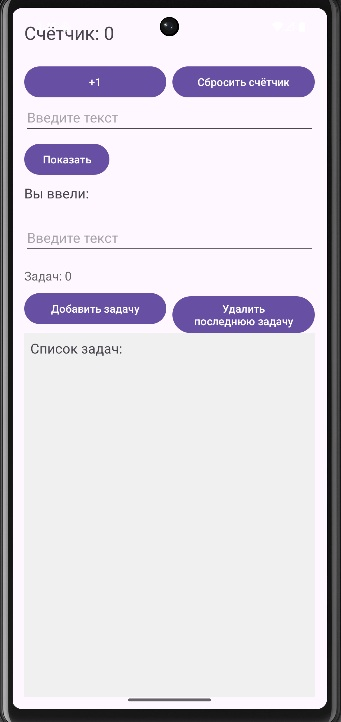

<div align="center">
    
МИНИСТЕРСТВО НАУКИ И ВЫСШЕГО ОБРАЗОВАНИЯ РОССИЙСКОЙ ФЕДЕРАЦИИ ФЕДЕРАЛЬНОЕ ГОСУДАРСТВЕННОЕ БЮДЖЕТНОЕ ОБРАЗОВАТЕЛЬНОЕ УЧРЕЖДЕНИЕ ВЫСШЕГО ОБРАЗОВАНИЯ
"САХАЛИНСКИЙ ГОСУДАРСТВЕННЫЙ УНИВЕРСИТЕТ»

<br><br><br><br>

Институт естественных наук и техносферной безопасности

Кафедра информатики

Лапырёнок Анастасия

<br><br><br><br>

Лабораторная работа №5

«Реализация ToDo-списка»

01.03.02 Прикладная математика и информатика

<br><br><br><br><br>

<div align="right">
Научный руководитель

Соболев Евгений Игоревич
</div>

<br><br><br><br><br>

г. Южно-Сахалинск
2026 г.

</div>

<br><br>

**Цель работы:** Научиться обрабатывать пользовательский ввод, работать с состоянием (счетчик, список задач), динамически обновлять интерфейс приложения на Kotlin.

<br><br>


## Листинг файла `activity_main.xml`

```kotlin
<?xml version="1.0" encoding="utf-8"?>
<LinearLayout
    xmlns:android="http://schemas.android.com/apk/res/android"
    android:layout_width="match_parent"
    android:layout_height="match_parent"
    android:orientation="vertical"
    android:padding="16dp">
    <!-- Корневой контейнер: LinearLayout занимает всю площадь экрана,
         имеет вертикальную ориентацию и отступ 16 dp со всех сторон -->

    <!-- Блок 1: Счётчик -->
    <TextView
        android:id="@+id/textCounter"
        android:layout_width="wrap_content"
        android:layout_height="wrap_content"
        android:text="@string/counter_text"
        android:textSize="24sp"
        android:layout_marginBottom="16dp"/>
    <!-- Текстовое поле для отображения значения счётчика:
         размер шрифта — 24 sp, отступ снизу — 16 dp -->

    <!-- Горизонтальный контейнер для кнопок счётчика -->
    <LinearLayout
        android:layout_width="match_parent"
        android:layout_height="wrap_content"
        android:orientation="horizontal"
        android:gravity="start"
        android:layout_marginTop="8dp">
        <!-- Контейнер на всю ширину экрана, с горизонтальной ориентацией,
             выравнивание содержимого по левому краю, отступ сверху — 8 dp -->

        <Button
            android:id="@+id/buttonIncrement"
            android:layout_width="0dp"
            android:layout_height="wrap_content"
            android:text="@string/button_increment"
            android:layout_weight="1"
            android:layout_marginEnd="8dp" />
        <!-- Кнопка «Увеличить»: занимает 50 % ширины контейнера (за счёт weight),
             отступ справа — 8 dp -->

        <Button
            android:id="@+id/buttonReset"
            android:layout_width="0dp"
            android:layout_height="wrap_content"
            android:text="@string/button_count"
            android:layout_weight="1" />
        <!-- Кнопка «Сброс»: занимает 50 % ширины контейнера (weight = 1),
             текст берётся из строковых ресурсов -->
    </LinearLayout>

    <!-- Блок 2: Поле ввода и отображение текста -->
    <EditText
        android:id="@+id/editTextInput"
        android:layout_width="match_parent"
        android:layout_height="wrap_content"
        android:hint="@string/hint_input"
        android:inputType="text"
        android:layout_marginBottom="8dp"/>
    <!-- Поле для ввода текста: на всю ширину экрана, подсказка из строковых ресурсов,
         тип ввода — обычный текст, отступ снизу — 8 dp -->

    <Button
        android:id="@+id/buttonShow"
        android:layout_width="wrap_content"
        android:layout_height="wrap_content"
        android:text="@string/button_show"
        android:layout_marginBottom="8dp"/>
    <!-- Кнопка «Показать»: размер определяется содержимым, текст из строковых ресурсов,
         отступ снизу — 8 dp -->

    <TextView
        android:id="@+id/textEntered"
        android:layout_width="wrap_content"
        android:layout_height="wrap_content"
        android:text="@string/label_entered"
        android:textSize="18sp"
        android:layout_marginBottom="24dp"/>
    <!-- Текстовое поле для вывода введённого текста: размер определяется содержимым,
         шрифт — 18 sp, отступ снизу — 24 dp -->

    <!-- Блок 3: ToDo список -->
    <EditText
        android:id="@+id/editTextTask"
        android:layout_width="match_parent"
        android:layout_height="wrap_content"
        android:hint="@string/hint_input"
        android:inputType="text"
        android:layout_marginBottom="8dp"/>
    <!-- Поле для ввода новой задачи: на всю ширину экрана, подсказка из ресурсов,
         отступ снизу — 8 dp -->

    <!-- Счётчик задач -->
    <TextView
        android:id="@+id/textTaskCount"
        android:layout_width="wrap_content"
        android:layout_height="wrap_content"
        android:text="Задач: 0"
        android:textSize="16sp"
        android:textColor="#666666"
        android:layout_marginTop="8dp" />
    <!-- Отображает количество задач в списке: начальный текст — «Задач: 0»,
         цвет текста — серый (#666666), отступ сверху — 8 dp -->

    <!-- Горизонтальный контейнер для кнопок задач -->
    <LinearLayout
        android:layout_width="match_parent"
        android:layout_height="wrap_content"
        android:orientation="horizontal"
        android:gravity="start"
        android:layout_marginTop="8dp">
        <!-- Контейнер для кнопок управления задачами: на всю ширину, горизонтальная ориентация,
             отступ сверху — 8 dp -->

        <Button
            android:id="@+id/buttonAddTask"
            android:layout_width="0dp"
            android:layout_height="wrap_content"
            android:text="@string/button_add_task"
            android:layout_weight="1"
            android:layout_marginEnd="8dp" />
        <!-- Кнопка «Добавить задачу»: занимает 50 % ширины, отступ справа — 8 dp,
             текст из строковых ресурсов -->

        <Button
            android:id="@+id/buttonRemoveLast"
            android:layout_width="0dp"
            android:layout_height="wrap_content"
            android:text="@string/button_del"
            android:layout_weight="1" />
        <!-- Кнопка «Удалить последнюю»: занимает 50 % ширины, текст из ресурсов -->
    </LinearLayout>

    <TextView
        android:id="@+id/textTasks"
        android:layout_width="match_parent"
        android:layout_height="0dp"
        android:layout_weight="1"
        android:text="@string/label_tasks"
        android:textSize="18sp"
        android:background="#F0F0F0"
        android:padding="8dp"/>
    <!-- Область для отображения списка задач: растягивается на оставшееся пространство (weight = 1),
         фон — светло‑серый (#F0F0F0), отступы внутри — 8 dp, шрифт — 18 sp -->

</LinearLayout>

```

<br><br>

## Листинг файла `Main.Activity.kt`

```kotlin
package com.example.todoapp

import android.os.Bundle
import android.widget.Button
import android.widget.EditText
import android.widget.TextView
import android.widget.Toast
import androidx.activity.enableEdgeToEdge
import androidx.appcompat.app.AppCompatActivity
import androidx.core.view.ViewCompat
import androidx.core.view.WindowInsetsCompat
import kotlin.collections.mutableListOf

// Основной класс активности приложения, наследуется от AppCompatActivity
class MainActivity : AppCompatActivity() {
    private var counter = 0 // Переменная для хранения значения счётчика
    private val tasks = mutableListOf<String>() // Список задач ToDo; объявлен на уровне класса для доступа во всех методах

    override fun onCreate(savedInstanceState: Bundle?) {
        super.onCreate(savedInstanceState)
        setContentView(R.layout.activity_main) // Устанавливаем интерфейс из activity_main.xml

        // Находим элементы интерфейса по ID
        val textCounter = findViewById<TextView>(R.id.textCounter) // Текстовое поле для счётчика
        val buttonIncrement = findViewById<Button>(R.id.buttonIncrement) // Кнопка «Увеличить»
        val buttonReset = findViewById<Button>(R.id.buttonReset) // Кнопка «Сброс»
        val textTaskCount = findViewById<TextView>(R.id.textTaskCount) // Текстовое поле с количеством задач

        // Восстанавливаем данные, если есть сохранённое состояние (например, при повороте экрана)
        if (savedInstanceState != null) {
            counter = savedInstanceState.getInt("counter", 0) // Восстанавливаем значение счётчика
            val savedTasks = savedInstanceState.getStringArrayList("tasks") // Получаем сохранённый список задач
            if (savedTasks != null) {
                tasks.clear() // Очищаем текущий список
                tasks.addAll(savedTasks) // Добавляем восстановленные задачи
            }
        }

        // Обновляем отображение счётчика, списка задач и количества задач
        updateCounterDisplay(textCounter)
        updateTasksDisplay(findViewById(R.id.textTasks), tasks)
        updateTaskCountDisplay(textTaskCount, tasks)

        // Обработчик нажатия кнопки «Увеличить»
        buttonIncrement.setOnClickListener {
            counter++ // Увеличиваем значение счётчика на 1
            updateCounterDisplay(textCounter) // Обновляем отображение
        }

        // Обработчик нажатия кнопки «Сброс»
        buttonReset.setOnClickListener {
            counter = 0 // Сбрасываем счётчик до нуля
            updateCounterDisplay(textCounter) // Обновляем отображение
            // Показываем всплывающее сообщение о сбросе
            Toast.makeText(this, "Счётчик сброшен", Toast.LENGTH_SHORT).show()
        }

        // Находим элементы для работы с вводом и отображением текста
        val editTextInput = findViewById<EditText>(R.id.editTextInput) // Поле ввода текста
        val buttonShow = findViewById<Button>(R.id.buttonShow) // Кнопка «Показать»
        val textEntered = findViewById<TextView>(R.id.textEntered) // Текстовое поле для вывода введённого текста

        // Обработчик нажатия кнопки «Показать»
        buttonShow.setOnClickListener {
            val inputText = editTextInput.text.toString() // Получаем текст из поля ввода
            // Выводим текст в формате «Введённый текст: [текст]»
            textEntered.text = getString(R.string.label_entered) + " $inputText"
        }

        // Находим элементы для работы со списком задач
        val editTextTask = findViewById<EditText>(R.id.editTextTask) // Поле для ввода новой задачи
        val buttonAddTask = findViewById<Button>(R.id.buttonAddTask) // Кнопка «Добавить задачу»
        val textTasks = findViewById<TextView>(R.id.textTasks) // Текстовое поле для отображения списка задач
        val buttonRemoveLast = findViewById<Button>(R.id.buttonRemoveLast) // Кнопка «Удалить последнюю»

        // Обработчик нажатия кнопки «Добавить задачу»
        buttonAddTask.setOnClickListener {
            val task = editTextTask.text.toString() // Получаем текст задачи из поля ввода
            if (task.isNotBlank()) { // Проверяем, что текст не пустой
                tasks.add(task) // Добавляем задачу в список
                updateTasksDisplay(textTasks, tasks) // Обновляем отображение списка задач
                updateTaskCountDisplay(textTaskCount, tasks) // Обновляем счётчик задач
                editTextTask.text.clear() // Очищаем поле ввода
            } else {
                // Показываем сообщение, если задача не введена
                Toast.makeText(this, "Введите задачу", Toast.LENGTH_SHORT).show()
            }
        }

        // Обработчик нажатия кнопки «Удалить последнюю»
        buttonRemoveLast.setOnClickListener {
            if (tasks.isNotEmpty()) { // Проверяем, что список задач не пуст
                val removedTask = tasks.removeAt(tasks.size - 1) // Удаляем последнюю задачу
                updateTasksDisplay(textTasks, tasks) // Обновляем отображение списка
                updateTaskCountDisplay(textTaskCount, tasks) // Обновляем счётчик
                // Показываем сообщение об удаленной задаче
                Toast.makeText(
                    this,
                    "Удалена задача: $removedTask",
                    Toast.LENGTH_SHORT
                ).show()
            } else {
                // Сообщение, если нет задач для удаления
                Toast.makeText(this, "Нет задач для удаления", Toast.LENGTH_SHORT).show()
            }
        }
    }

    // Сохраняем состояние активности перед её уничтожением (например, при повороте экрана)
    override fun onSaveInstanceState(outState: Bundle) {
        super.onSaveInstanceState(outState)
        outState.putInt("counter", counter) // Сохраняем значение счётчика
        outState.putStringArrayList("tasks", ArrayList(tasks)) // Сохраняем список задач
    }

    // Метод для обновления отображения счётчика
    private fun updateCounterDisplay(textView: TextView) {
        // Устанавливаем текст в формате из строковых ресурсов с подстановкой значения счётчика
        textView.text = getString(R.string.counter_text, counter)
    }

    // Метод для обновления отображения списка задач
    private fun updateTasksDisplay(textTasks: TextView, tasks: List<String>) {
        if (tasks.isEmpty()) {
            // Если задач нет, показываем текст по умолчанию из ресурсов
            textTasks.text = getString(R.string.label_tasks)
        } else {
            // Форматируем список: каждая задача с префиксом «• » и переносом строки
            textTasks.text = tasks.joinToString("\n• ") { "• $it" }
        }
    }

    // Метод для обновления отображения количества задач
    private fun updateTaskCountDisplay(textTaskCount: TextView, tasks: List<String>) {
        // Устанавливаем текст вида «Задач: [количество]»
        textTaskCount.text = "Задач: ${tasks.size}"
    }
}
```

<br><br>

### Скриншот приложения с отображением результатов


<br><br>

### Ответы на контрольные вопросы:

#### 1. Как получить текст из EditText?

В Kotlin:
```kotlin
val text = editText.text.toString()
```

#### 2. Почему при повороте экрана данные (счётчик, список задач) сбрасываются? Как это можно исправить?

**Причина:**  
При повороте экрана система уничтожает и пересоздаёт `Activity` — состояние не сохраняется автоматически. Это связано с тем, что смена ориентации считается изменением конфигурации, из‑за чего система запускает полный цикл пересоздания активности.

**Способы исправления:**

1. **Использовать `ViewModel` для хранения данных** (рекомендуемый способ):
   * `ViewModel` сохраняет данные при изменении конфигурации (поворот экрана, смена темы и т. д.);
   * данные остаются доступными после пересоздания `Activity`;
   * интеграция с `LiveData` или `StateFlow` позволяет автоматически обновлять UI при изменении данных.

   Пример:
   ```kotlin
   class MyViewModel : ViewModel() {
       val taskList = mutableStateOf<List<String>>(emptyList())
   }
   ```
2. **Переопределить `onSaveInstanceState()` и сохранить данные в `Bundle`**:

   * В методе `onSaveInstanceState(Bundle outState)` сохраните нужные данные — этот метод вызывается перед уничтожением `Activity` при изменении конфигурации.
   * Восстановите данные в `onCreate(Bundle savedInstanceState)` или `onRestoreInstanceState(Bundle savedInstanceState)` — система передаёт сохранённый `Bundle`, из которого можно извлечь ранее записанные значения.


#### 3. Для чего используется joinToString? Как изменить разделитель?

**Назначение**

`joinToString()` — функция Kotlin для преобразования коллекции (списка, массива и т. д.) в единую строку путём объединения её элементов.

По умолчанию элементы разделяются запятой с пробелом (`", "`), а результат похож на вывод `toString()`, но без квадратных скобок:

```kotlin
listOf("A", "B", "C").joinToString()
// Результат: "A, B, C"
```
**Изменение разделителя в `joinToString()`**

Чтобы изменить разделитель между элементами при использовании функции `joinToString()`, передайте нужное значение в параметр `separator`.

**Синтаксис:**
```kotlin
collection.joinToString(separator = "ваш_разделитель")
```


#### 4. В чём разница между List и MutableList?

**`List` (неизменяемый)**

* **Неизменяемая** коллекция — нельзя добавлять, удалять или менять элементы после создания.
* Создаётся через `listOf()`.
* Поддерживает только чтение: доступ по индексу, проверку наличия элементов, итерацию.
* Потокобезопасен (thread‑safe).
* Подходит для статических данных и функционального стиля программирования.

**Пример:**
```kotlin
val fruits = listOf("Apple", "Orange", "Banana")
println(fruits[0]) // "Apple"
// fruits.add("Grape") // Ошибка компиляции!
```
**`MutableList` (изменяемый)**

* **Изменяемая** коллекция — можно добавлять, удалять и обновлять элементы после создания.
* Создаётся через `mutableListOf()`.
* Поддерживает все операции чтения и записи.
* Подходит для динамических списков.

**Пример:**
```kotlin
val numbers = mutableListOf(1, 2, 3)
numbers.add(4)
numbers[0] = 10
println(numbers) // [10, 2, 3, 4]
```

#### 5. Как очистить поле ввода после добавления задачи?

Чтобы очистить поле ввода (например, `EditText` в Android), установите его текст в пустую строку сразу после обработки добавления задачи.

**Пример на Kotlin (Android):**
```kotlin
// Предположим, editTextTask — это ваш EditText, а addTaskButton — кнопка добавления
addTaskButton.setOnClickListener {
    // Здесь код добавления задачи (сохранение данных и т. д.)
    addTask(editTextTask.text.toString())
    
    // Очистка поля ввода
    editTextTask.setText("")
    // Или альтернативный вариант:
    // editTextTask.text.clear()
}
```


## Вывод

В ходе выполнения работы были успешно решены следующие задачи:

- освоена обработка пользовательского ввода в Android‑приложении на Kotlin;
- реализовано управление состоянием приложения (счётчик и список задач);
- обеспечено динамическое обновление пользовательского интерфейса при действиях пользователя;
- решена проблема потери данных при смене конфигурации устройства (например, при повороте экрана) за счёт использования методов `onSaveInstanceState()` и `onCreate(savedInstanceState)`;
- изучены ключевые аспекты работы с коллекциями в Kotlin: различия между `List` (неизменяемый) и `MutableList` (изменяемый);
- отработано применение метода `joinToString()` для форматирования вывода списка задач;
- освоено взаимодействие с основными UI‑элементами Android: `EditText`, `TextView`, `Button`.

**Итог:** все поставленные цели достигнуты, функционал приложения (счётчик, ввод текста, ToDo‑список с добавлением и удалением задач) реализован и протестирован.
