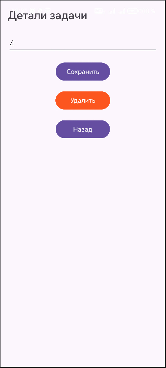

<div align="center">
    
МИНИСТЕРСТВО НАУКИ И ВЫСШЕГО ОБРАЗОВАНИЯ РОССИЙСКОЙ ФЕДЕРАЦИИ ФЕДЕРАЛЬНОЕ ГОСУДАРСТВЕННОЕ БЮДЖЕТНОЕ ОБРАЗОВАТЕЛЬНОЕ УЧРЕЖДЕНИЕ ВЫСШЕГО ОБРАЗОВАНИЯ
"САХАЛИНСКИЙ ГОСУДАРСТВЕННЫЙ УНИВЕРСИТЕТ»

<br><br><br><br>

Институт естественных наук и техносферной безопасности

Кафедра информатики

Лапырёнок Анастасия

<br><br><br><br>

Лабораторная работа №7

«Добавление второго экрана (детали задачи). Переход по клику на элемент списка»

01.03.02 Прикладная математика и информатика

<br><br><br><br><br>

<div align="right">
Научный руководитель

Соболев Евгений Игоревич
</div>

<br><br><br><br><br>

г. Южно-Сахалинск
2026 г.

</div>

<br><br>

**Цель работы:** Научиться создавать многоэкранные приложения, осуществлять переход между экранами с передачей данных через `Intent`, обрабатывать клики на элементах `RecyclerView`.


<br><br>


## Листинг файла `activity_detail.xml`

```xml
<?xml version="1.0" encoding="utf-8"?>
<LinearLayout
    xmlns:android="http://schemas.android.com/apk/res/android"
    android:layout_width="match_parent"
    android:layout_height="match_parent"
    android:orientation="vertical"
    android:padding="16dp">

    <TextView
        android:layout_width="wrap_content"
        android:layout_height="wrap_content"
        android:text="Детали задачи"
        android:textSize="24sp"
        android:textStyle="bold"
        android:layout_marginBottom="24dp"/>

    <EditText
        android:id="@+id/editTextTaskDetail"
        android:layout_width="match_parent"
        android:layout_height="wrap_content"
        android:layout_marginBottom="16dp"/>

    <Button
        android:id="@+id/buttonSave"
        android:layout_width="wrap_content"
        android:layout_height="wrap_content"
        android:text="Сохранить"
        android:layout_gravity="center_horizontal"
        android:layout_marginBottom="16dp"/>

    <Button
        android:id="@+id/buttonDelete"
        android:layout_width="wrap_content"
        android:layout_height="wrap_content"
        android:text="Удалить"
        android:layout_gravity="center_horizontal"
        android:backgroundTint="#FF5722"
        android:layout_marginBottom="16dp"/>

    <Button
        android:id="@+id/buttonBack"
        android:layout_width="wrap_content"
        android:layout_height="wrap_content"
        android:text="Назад"
        android:layout_gravity="center_horizontal"/>

</LinearLayout>
```

<br><br>

<br><br>

## Листинг файла `DetailActivity.kt`

```kotlin
package com.example.lab6

import android.app.AlertDialog
import android.content.Intent
import android.os.Bundle
import android.widget.Button
import android.widget.EditText
import android.widget.TextView
import androidx.appcompat.app.AppCompatActivity

class DetailActivity : AppCompatActivity() {

    override fun onCreate(savedInstanceState: Bundle?) {
        super.onCreate(savedInstanceState)
        setContentView(R.layout.activity_detail)

        val editTextTaskDetail = findViewById<EditText>(R.id.editTextTaskDetail)
        val buttonBack = findViewById<Button>(R.id.buttonBack)
        val buttonSave = findViewById<Button>(R.id.buttonSave)
        val buttonDelete = findViewById<Button>(R.id.buttonDelete)

        // Получаем данные из Intent
        val taskText = intent.getStringExtra("task_text") ?: "Нет данных"
        // Сохраняем исходный текст для поиска позиции при возврате
        val originalTaskText = taskText

        editTextTaskDetail.setText(taskText)

        // Кнопка "Сохранить" — редактирование задачи
        buttonSave.setOnClickListener {
            val newText = editTextTaskDetail.text.toString()
            if (newText.isNotBlank()) {
                val resultIntent = Intent()
                resultIntent.putExtra("edited_task", newText)
                resultIntent.putExtra("original_task_text", originalTaskText)  // Передаём исходный текст
                setResult(RESULT_OK, resultIntent)
                finish()
            } else {
                showErrorDialog("Текст задачи не может быть пустым")
            }
        }

        // Кнопка "Удалить" с подтверждением
        buttonDelete.setOnClickListener {
            showDeleteConfirmation { confirmed ->
                if (confirmed) {
                    val resultIntent = Intent()
                    resultIntent.putExtra("delete_task_text", originalTaskText)  // Передаём текст для удаления
                    setResult(RESULT_OK, resultIntent)
                    finish()
                }
            }
        }

        buttonBack.setOnClickListener {
            finish()
        }
    }

    private fun showDeleteConfirmation(onConfirm: (Boolean) -> Unit) {
        AlertDialog.Builder(this)
            .setTitle("Подтверждение удаления")
            .setMessage("Вы уверены, что хотите удалить эту задачу?")
            .setPositiveButton("Удалить") { _, _ ->
                onConfirm(true)
            }
            .setNegativeButton("Отмена") { _, _ ->
                onConfirm(false)
            }
            .show()
    }

    private fun showErrorDialog(message: String) {
        AlertDialog.Builder(this)
            .setTitle("Ошибка")
            .setMessage(message)
            .setPositiveButton("ОК", null)
            .show()
    }
}
```

## Листинг файла `TaskAdapter.kt`

```kotlin
package com.example.lab6

import android.graphics.Paint
import android.view.LayoutInflater
import android.view.View
import android.view.ViewGroup
import android.widget.CheckBox
import android.widget.TextView
import androidx.recyclerview.widget.RecyclerView


class TaskAdapter(
    private val tasks: MutableList<String>,
    private val onItemClick: (String, Int) -> Unit
) : RecyclerView.Adapter<TaskAdapter.TaskViewHolder>() {

    class TaskViewHolder(itemView: View) : RecyclerView.ViewHolder(itemView) {
        val textTask: TextView = itemView.findViewById(R.id.textTask)
        val checkTask: CheckBox = itemView.findViewById(R.id.checkTask)
    }

    override fun onCreateViewHolder(parent: ViewGroup, viewType: Int): TaskViewHolder {
        val view = LayoutInflater.from(parent.context)
            .inflate(R.layout.item_task, parent, false)
        return TaskViewHolder(view)
    }


    override fun onBindViewHolder(holder: TaskViewHolder, position: Int) {
        val task = tasks[position]
        holder.textTask.text = task

        // Установка цвета фона
        if (position % 2 == 0) {
            holder.itemView.setBackgroundColor(0xFFF5F5F5.toInt())
        } else {
            holder.itemView.setBackgroundColor(0xFFFFFFFF.toInt())
        }

        
        holder.checkTask.setOnCheckedChangeListener { _, isChecked ->
            if (isChecked) {
                holder.textTask.paintFlags = holder.textTask.paintFlags or Paint.STRIKE_THRU_TEXT_FLAG
            } else {
                holder.textTask.paintFlags = holder.textTask.paintFlags and Paint.STRIKE_THRU_TEXT_FLAG.inv()
            }
        }

        // Устанавливаем обработчик клика — передаём актуальную позицию
        holder.itemView.setOnClickListener {
            onItemClick(task, position)  // Передаём текущий текст и позицию
        }
    }


    override fun getItemCount(): Int = tasks.size

    // Удаление задачи по позиции
    fun removeTask(position: Int) {
        if (position in tasks.indices) {
            tasks.removeAt(position)
            notifyItemRemoved(position)
        }
    }


    //Добавление задачи по позиции
    fun insertTask(position: Int, task: String) {
        tasks.add(position, task)
        notifyItemInserted(position)
    }


    // Получение задачи по позиции
    fun getTaskAt(position: Int): String {
        return if (position in tasks.indices) tasks[position] else ""
    }
    
}
```

<br><br>

## Листинг файла `Main.Activity.kt`

```kotlin
package com.example.lab6

import android.content.Intent
import android.os.Bundle
import android.widget.Button
import android.widget.EditText
import android.widget.Toast
import androidx.appcompat.app.AlertDialog
import androidx.appcompat.app.AppCompatActivity
import androidx.recyclerview.widget.DefaultItemAnimator
import androidx.recyclerview.widget.ItemTouchHelper
import androidx.recyclerview.widget.LinearLayoutManager
import androidx.recyclerview.widget.RecyclerView


class MainActivity : AppCompatActivity() {

    private val tasks = mutableListOf<String>()
    private lateinit var adapter: TaskAdapter

    override fun onCreate(savedInstanceState: Bundle?) {
        super.onCreate(savedInstanceState)
        setContentView(R.layout.activity_main)

        val editTextTask = findViewById<EditText>(R.id.editTextTask)
        val buttonAddTask = findViewById<Button>(R.id.buttonAddTask)
        val recyclerView = findViewById<RecyclerView>(R.id.recyclerViewTasks)


        // Настройка RecyclerView
        recyclerView.layoutManager = LinearLayoutManager(this)

        adapter = TaskAdapter(tasks) { taskText, position ->
            val intent = Intent(this, DetailActivity::class.java)
            intent.putExtra("task_text", taskText)
            intent.putExtra("task_position", position)  // Передаём актуальную позицию
            startActivityForResult(intent, 1)
        }


        recyclerView.adapter = adapter

        // Добавление анимации
        val itemAnimator = DefaultItemAnimator()
        itemAnimator.addDuration = 300
        itemAnimator.removeDuration = 300
        recyclerView.itemAnimator = itemAnimator

        // Добавление задачи
        buttonAddTask.setOnClickListener {
            val task = editTextTask.text.toString()
            if (task.isNotBlank()) {
                tasks.add(task)
                adapter.notifyItemInserted(tasks.size - 1) // более эффективно, чем notifyDataSetChanged
                editTextTask.text.clear()
            } else {
                Toast.makeText(this, "Введите задачу", Toast.LENGTH_SHORT).show()
            }
        }

        // Восстановление данных при повороте
        if (savedInstanceState != null) {
            val savedTasks = savedInstanceState.getStringArrayList("tasks")
            if (savedTasks != null) {
                tasks.clear()
                tasks.addAll(savedTasks)
                adapter.notifyDataSetChanged()
            }
        }

        val itemTouchHelper = ItemTouchHelper(SwipeToDeleteCallback(this, adapter))
        itemTouchHelper.attachToRecyclerView(recyclerView)
    }

    override fun onActivityResult(requestCode: Int, resultCode: Int, data: Intent?) {
        super.onActivityResult(requestCode, resultCode, data)

        if (resultCode == RESULT_OK && data != null) {
            when (requestCode) {
                1 -> {
                    // Обработка редактирования
                    if (data.hasExtra("edited_task")) {
                        val editedTask = data.getStringExtra("edited_task")!!
                        val originalPosition = data.getIntExtra("original_position", -1)

                        // Находим задачу по тексту, а не по позиции
                        val currentPosition = tasks.indexOfFirst { it == data.getStringExtra("original_task_text") }
                        if (currentPosition != -1) {
                            tasks[currentPosition] = editedTask
                            adapter.notifyItemChanged(currentPosition)
                        }
                    }

                    // Обработка удаления
                    if (data.hasExtra("delete_task_text")) {
                        val taskToDelete = data.getStringExtra("delete_task_text")!!
                        val positionToDelete = tasks.indexOf(taskToDelete)
                        if (positionToDelete != -1) {
                            tasks.removeAt(positionToDelete)
                            adapter.notifyItemRemoved(positionToDelete)
                        }
                    }
                }
            }
        }
    }


    override fun onSaveInstanceState(outState: Bundle) {
        super.onSaveInstanceState(outState)
        outState.putStringArrayList("tasks", ArrayList(tasks))
    }

    private fun showEditDialog(position: Int, currentText: String) {
        val builder = AlertDialog.Builder(this)
        builder.setTitle("Редактировать задачу")

        val input = EditText(this)
        input.setText(currentText)
        builder.setView(input)

        builder.setPositiveButton("Сохранить") { _, _ ->
            val newText = input.text.toString()
            if (newText.isNotBlank()) {
                tasks[position] = newText
                adapter.notifyItemChanged(position)
            } else {
                Toast.makeText(this, "Текст не может быть пустым", Toast.LENGTH_SHORT).show()
            }
        }
        builder.setNegativeButton("Отмена") { dialog, _ -> dialog.cancel() }

        builder.show()
    }
}
```

<br><br>

## Скриншот приложения с отображением результатов


<br><br>

## Ответы на контрольные вопросы:

### 1. Что такое Intent? Какие виды Intent существуют?

**Intent** — механизм в Android для описания операции и передачи сообщений между компонентами приложения (Activity, Service, BroadcastReceiver).

**Виды Intent:**

* **Explicit (явный) Intent** — указывает конкретный компонент для запуска (обычно используется для перехода между Activity внутри одного приложения). Пример: запуск `SecondActivity` из `MainActivity`.
* **Implicit (неявный) Intent** — не указывает конкретный компонент, а описывает действие (`action`) и данные (`data`). Система находит подходящие компоненты в любых приложениях. Пример: открыть ссылку в браузере, отправить email.

### 2. Как передать данные из одной Activity в другую?


Данные передаются через **Intent** с помощью методов `putExtra()`:

1. В исходной Activity создайте Intent и добавьте данные:
```kotlin
val intent = Intent(this, SecondActivity::class.java)
intent.putExtra("KEY_NAME", "Hello from FirstActivity!")
startActivity(intent)
```
2. Во второй Activity получите данные:
```kotlin
val receivedData = intent.getStringExtra("KEY_NAME")
```

**Поддерживаемые типы данных:** строки, числа, булевы значения, массивы, объекты, реализующие `Serializable` или `Parcelable`.

### 3. Какие способы обработки кликов на элементах RecyclerView вы знаете?


Основные способы:

* **Установка `OnClickListener` в `ViewHolder`** — обработчик клика задаётся при создании ViewHolder, позиция получается через `adapterPosition`. Эффективно, так как не пересоздаётся при каждом `onBindViewHolder`.
* **Установка `OnClickListener` в `onBindViewHolder`** — простой способ, но обработчик назначается заново при каждой привязке данных. Менее эффективно.
* **Использование интерфейса слушателя (Listener Interface)** — в адаптере определяется интерфейс, который реализуется в Activity/Fragment. Позволяет отделить логику обработки клика.
* **Lambda‑выражения (в Kotlin)** — передача лямбды в конструктор адаптера. Современный и лаконичный подход.
* **Обработка кликов на отдельных View внутри элемента** — если нужно реагировать на нажатие не всего элемента, а конкретной кнопки или изображения внутри него.

### 4. Как создать новую Activity в Android Studio?

Пошаговая инструкция:

1. В **Project View** кликните правой кнопкой мыши по пакету, где хотите создать Activity (например, `com.example.myapp`).
2. Выберите **New → Activity → Empty Activity** (или другой шаблон).
3. В диалоговом окне укажите:
   * **Activity Name** — имя класса (например, `SecondActivity`). Android Studio автоматически добавит суффикс `Activity`.
   * **Layout Name** — имя файла разметки (например, `activity_second`).
   * **Source Language** — Kotlin или Java.
4. Нажмите **Finish**.

Android Studio:
* создаст класс Activity (`SecondActivity.kt`);
* создаст файл разметки (`activity_second.xml`);
* добавит запись в `AndroidManifest.xml`.

### 5. Для чего используется метод `finish()`?

**Метод `finish()`** — завершает текущую Activity и удаляет её из стека активностей (back stack).

**Когда используется:**

* При переходе на новую Activity, если текущую больше не нужно сохранять в стеке (чтобы пользователь не мог вернуться назад по кнопке «Назад»).
* При выполнении определённого условия в логике приложения (например, после успешной авторизации).
* Для освобождения ресурсов, занятых Activity, когда она больше не нужна.

**Результат вызова:**
* вызывается метод `onDestroy()` текущей Activity;
* управление передаётся предыдущей Activity в стеке;
* если текущая Activity была единственной, приложение закрывается.

## Вывод

В ходе работы успешно освоены ключевые навыки разработки многоэкранных Android‑приложений:

1. **Реализован переход между экранами** с использованием `Intent`: из `MainActivity` в `DetailActivity` передаётся текст задачи для редактирования.
2. **Организована передача данных через `Intent`** в обоих направлениях:
   * из `MainActivity` в `DetailActivity` (текст задачи);
   * обратно из `DetailActivity` в `MainActivity` (отредактированный текст либо сигнал на удаление задачи).
3. **Настроена обработка кликов на элементах `RecyclerView`** через лямбда‑выражение в адаптере (`TaskAdapter`), что позволяет открывать экран редактирования при нажатии на задачу.
4. **Добавлены интерактивные элементы управления задачами**:
   * добавление новой задачи через `EditText` и кнопку;
   * редактирование задачи на отдельном экране с сохранением изменений;
   * удаление задачи с подтверждением через `AlertDialog`;
   * визуальное выделение выполненных задач (зачёркивание текста при активации `CheckBox`).
5. **Обеспечена устойчивость к повороту экрана** за счёт сохранения списка задач в `onSaveInstanceState()` и их восстановления в `onCreate()`.
6. **Оптимизирована работа `RecyclerView`**:
   * использованы методы точечного обновления (`notifyItemInserted()`, `notifyItemRemoved()`, `notifyItemChanged()`) вместо полного перестроения списка;
   * добавлена анимация при добавлении/удалении элементов через `DefaultItemAnimator`.

Таким образом, цель работы — научиться создавать многоэкранные приложения с передачей данных и обработкой кликов — достигнута. Полученное приложение демонстрирует корректную работу всех основных механизмов взаимодействия между `Activity` и элементами интерфейса.
