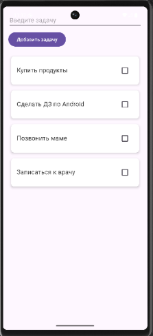

<div align="center">
    
МИНИСТЕРСТВО НАУКИ И ВЫСШЕГО ОБРАЗОВАНИЯ РОССИЙСКОЙ ФЕДЕРАЦИИ ФЕДЕРАЛЬНОЕ ГОСУДАРСТВЕННОЕ БЮДЖЕТНОЕ ОБРАЗОВАТЕЛЬНОЕ УЧРЕЖДЕНИЕ ВЫСШЕГО ОБРАЗОВАНИЯ
"САХАЛИНСКИЙ ГОСУДАРСТВЕННЫЙ УНИВЕРСИТЕТ»

<br><br><br><br>

Институт естественных наук и техносферной безопасности

Кафедра информатики

Лапырёнок Анастасия

<br><br><br><br>

Лабораторная работа №8

«Перенос логики списка задач из `Activity` в `ViewModel`. Использование `StateFlow` для хранения состояния»

01.03.02 Прикладная математика и информатика

<br><br><br><br><br>

<div align="right">
Научный руководитель

Соболев Евгений Игоревич
</div>

<br><br><br><br><br>

г. Южно-Сахалинск
2026 г.

</div>

<br><br>

**Цель работы:** Изучить архитектурный компонент `ViewModel`, научиться выносить логику и состояние `UI` из `Activity`, использовать `StateFlow` для реактивного обновления данных, обеспечить сохранение состояния при изменении конфигурации.

<br><br>


## Листинг файла `MainViewModel`

```kotlin
package com.example.lab8

import androidx.lifecycle.ViewModel
import kotlinx.coroutines.flow.MutableStateFlow
import kotlinx.coroutines.flow.StateFlow
import kotlinx.coroutines.flow.asStateFlow

class MainViewModel : ViewModel() {
    private val _tasks = MutableStateFlow<List<Pair<String, Boolean>>>(emptyList())
    val tasks: StateFlow<List<Pair<String, Boolean>>> = _tasks.asStateFlow()

    fun addTask(task: String) {
        val currentList = _tasks.value.toMutableList()
        currentList.add(task to false)
        _tasks.value = currentList
    }

    fun deleteTask(index: Int) {
        val currentList = _tasks.value.toMutableList()
        if (index in currentList.indices) {
            currentList.removeAt(index)
            _tasks.value = currentList
        }
    }

    fun updateTaskCompletion(index: Int, isCompleted: Boolean) {
        val currentList = _tasks.value.toMutableList()
        if (index in currentList.indices) {
            currentList[index] = currentList[index].first to isCompleted
            _tasks.value = currentList
        }
    }

    fun loadTestData() {
        _tasks.value = listOf(
            "Купить продукты" to false,
            "Сделать ДЗ по Android" to false,
            "Позвонить маме" to false,
            "Записаться к врачу" to false
        )
    }

    fun updateTaskText(oldText: String, newText: String) {
        val currentList = _tasks.value.toMutableList()
        val index = currentList.indexOfFirst { it.first == oldText }
        if (index != -1) {
            currentList[index] = newText to currentList[index].second
            _tasks.value = currentList
        }
    }

    fun deleteTaskByText(taskText: String) {
        val currentList = _tasks.value.toMutableList()
        val index = currentList.indexOfFirst { it.first == taskText }
        if (index != -1) {
            currentList.removeAt(index)
            _tasks.value = currentList
        }
    }

    fun insertTaskAtPosition(position: Int, taskText: String) {
        val currentList = _tasks.value.toMutableList()
        // Вставляем задачу на прежнюю позицию с состоянием "не выполнена"
        currentList.add(position, taskText to false)
        _tasks.value = currentList
    }
}
```

<br><br>

## Листинг файла `TaskAdapter.kt`

```kotlin
package com.example.lab8

import android.graphics.Paint
import android.view.LayoutInflater
import android.view.View
import android.view.ViewGroup
import android.widget.CheckBox
import android.widget.TextView
import androidx.recyclerview.widget.RecyclerView


class TaskAdapter(
    private var tasks: List<Pair<String, Boolean>>,
    private val onItemClick: (Int) -> Unit,
    private val onItemLongClick: (Int) -> Unit,
    private val onCheckChanged: (Int, Boolean) -> Unit
) : RecyclerView.Adapter<TaskAdapter.TaskViewHolder>()
 {

    class TaskViewHolder(itemView: View) : RecyclerView.ViewHolder(itemView) {
        val textTask: TextView = itemView.findViewById(R.id.textTask)
        val checkTask: CheckBox = itemView.findViewById(R.id.checkTask)
    }

    override fun onCreateViewHolder(parent: ViewGroup, viewType: Int): TaskViewHolder {
        val view = LayoutInflater.from(parent.context)
            .inflate(R.layout.item_task, parent, false)
        return TaskViewHolder(view)
    }


     override fun onBindViewHolder(holder: TaskViewHolder, position: Int) {
         val (taskText, isCompleted) = tasks[position]
         holder.textTask.text = taskText

         // Устанавливаем состояние чекбокса
         holder.checkTask.isChecked = isCompleted

         // Обновляем стиль текста
         holder.textTask.paintFlags = if (isCompleted) {
             holder.textTask.paintFlags or Paint.STRIKE_THRU_TEXT_FLAG
         } else {
             holder.textTask.paintFlags and Paint.STRIKE_THRU_TEXT_FLAG.inv()
         }

         // Обработчик изменения состояния чекбокса
         holder.checkTask.setOnCheckedChangeListener { _, isChecked ->
             onCheckChanged(position, isChecked)
         }

         holder.itemView.setOnClickListener {
             onItemClick(position)
         }
         holder.itemView.setOnLongClickListener {
             onItemLongClick(position)
             true
         }
     }

     override fun getItemCount(): Int = tasks.size

     fun updateData(newTasks: List<Pair<String, Boolean>>) {
         tasks = newTasks
         notifyDataSetChanged()
     }
 }
```

<br><br>

## Листинг файла `MainActivity.kt`

```kotlin
package com.example.lab8

import android.content.Intent
import android.graphics.Canvas
import android.graphics.Color
import android.graphics.drawable.ColorDrawable
import android.os.Bundle
import android.widget.Button
import android.widget.EditText
import android.widget.Toast
import androidx.activity.result.contract.ActivityResultContracts
import androidx.activity.viewModels
import androidx.appcompat.app.AlertDialog
import androidx.appcompat.app.AppCompatActivity
import androidx.lifecycle.Lifecycle
import androidx.lifecycle.lifecycleScope
import androidx.lifecycle.repeatOnLifecycle
import androidx.recyclerview.widget.DefaultItemAnimator
import androidx.recyclerview.widget.ItemTouchHelper
import androidx.recyclerview.widget.LinearLayoutManager
import androidx.recyclerview.widget.RecyclerView
import com.google.android.material.snackbar.Snackbar
import kotlinx.coroutines.launch
import java.util.Collections.emptyList


class MainActivity : AppCompatActivity() {

    private val viewModel: MainViewModel by viewModels()
    private lateinit var adapter: TaskAdapter

    override fun onCreate(savedInstanceState: Bundle?) {
        super.onCreate(savedInstanceState)
        setContentView(R.layout.activity_main)

        val editTextTask = findViewById<EditText>(R.id.editTextTask)
        val buttonAddTask = findViewById<Button>(R.id.buttonAddTask)
        val recyclerView = findViewById<RecyclerView>(R.id.recyclerViewTasks)


        adapter = TaskAdapter(
            tasks = emptyList(),
            onItemClick = { position ->
                val taskText = viewModel.tasks.value[position].first
                val intent = Intent(this, DetailActivity::class.java)
                intent.putExtra("task_text", taskText)
                detailActivityResultLauncher.launch(intent)
            },
            onItemLongClick = { position ->
                viewModel.deleteTask(position)
                Toast.makeText(this, "Задача удалена", Toast.LENGTH_SHORT).show()
            },
            onCheckChanged = { position, isChecked ->
                viewModel.updateTaskCompletion(position, isChecked)
            }
        )

        // Настройка RecyclerView
        recyclerView.layoutManager = LinearLayoutManager(this)

        recyclerView.adapter = adapter

        // Создаём ItemTouchHelper с кастомным callback
        val itemTouchHelper = ItemTouchHelper(object : ItemTouchHelper.SimpleCallback(
            0, // Не поддерживаем drag-and-drop
            ItemTouchHelper.LEFT or ItemTouchHelper.RIGHT // Поддерживаем свайп влево и вправо
        ) {
            override fun onMove(
                recyclerView: RecyclerView,
                viewHolder: RecyclerView.ViewHolder,
                target: RecyclerView.ViewHolder
            ): Boolean = false // Drag не поддерживаем

            override fun onSwiped(viewHolder: RecyclerView.ViewHolder, direction: Int) {
                val position = viewHolder.adapterPosition
                val taskToDelete = viewModel.tasks.value[position]

                // Сохраняем данные удаляемой задачи для возможности отмены
                val deletedTask = taskToDelete.first

                // Удаляем задачу через ViewModel
                viewModel.deleteTask(position)

                // Показываем Snackbar с возможностью отмены
                showUndoSnackbar(deletedTask, position)
            }

            // Визуальное оформление при свайпе (опционально)
            override fun onChildDraw(
                c: Canvas,
                recyclerView: RecyclerView,
                viewHolder: RecyclerView.ViewHolder,
                dX: Float,
                dY: Float,
                actionState: Int,
                isCurrentlyActive: Boolean
            ) {
                super.onChildDraw(c, recyclerView, viewHolder, dX, dY, actionState, isCurrentlyActive)

                // Подсвечиваем фон при свайпе
                val itemView = viewHolder.itemView
                val background = ColorDrawable(Color.RED)
                background.setBounds(
                    itemView.right + dX.toInt(),
                    itemView.top,
                    itemView.right,
                    itemView.bottom
                )
                background.draw(c)
            }
        })

// Прикрепляем ItemTouchHelper к RecyclerView
        itemTouchHelper.attachToRecyclerView(recyclerView)


        // Подписка на изменения списка задач
        lifecycleScope.launch {
            repeatOnLifecycle(Lifecycle.State.STARTED) {
                viewModel.tasks.collect { tasks ->
                    adapter.updateData(tasks) // предполагаем, что у адаптера есть такой метод
                }
            }
        }

        // Добавление анимации
        val itemAnimator = DefaultItemAnimator()
        itemAnimator.addDuration = 300
        itemAnimator.removeDuration = 300
        recyclerView.itemAnimator = itemAnimator

        // Добавление задачи
        buttonAddTask.setOnClickListener {
            val task = editTextTask.text.toString()
            if (task.isNotBlank()) {
                viewModel.addTask(task)
                editTextTask.text.clear()
            } else {
                Toast.makeText(this, "Введите задачу", Toast.LENGTH_SHORT).show()
            }
        }

        // Загрузим тестовые данные при первом запуске (если список пуст)
        if (viewModel.tasks.value.isEmpty()) {
            viewModel.loadTestData()
        }


    }
    private val detailActivityResultLauncher = registerForActivityResult(
        ActivityResultContracts.StartActivityForResult()
    ) { result ->
        if (result.resultCode == RESULT_OK && result.data != null) {
            val action = result.data?.getStringExtra("action")
            val data = result.data?.getStringExtra("data")

            when (action) {
                "edit" -> {
                    val parts = data?.split("|")
                    if (parts != null && parts.size == 2) {
                        val originalText = parts[0]
                        val newText = parts[1]
                        viewModel.updateTaskText(originalText, newText)
                    }
                }
                "delete" -> {
                    data?.let { taskText ->
                        viewModel.deleteTaskByText(taskText)
                    }
                }
            }
        }
    }

    private fun showUndoSnackbar(taskText: String, position: Int) {
        Snackbar.make(
            findViewById(android.R.id.content),
            "Задача '$taskText' удалена",
            Snackbar.LENGTH_LONG
        ).setAction("ОТМЕНИТЬ") {
            // При нажатии "ОТМЕНИТЬ" восстанавливаем задачу
            viewModel.insertTaskAtPosition(position, taskText)
        }.show()
    }
}
```

<br><br>

## Листинг файла `DetailActivity.kt`

```kotlin
package com.example.lab8

import android.app.AlertDialog
import android.content.Intent
import android.os.Bundle
import android.widget.Button
import android.widget.EditText
import androidx.appcompat.app.AppCompatActivity

class DetailActivity : AppCompatActivity() {

    override fun onCreate(savedInstanceState: Bundle?) {
        super.onCreate(savedInstanceState)
        setContentView(R.layout.activity_detail)

        val editTextTaskDetail = findViewById<EditText>(R.id.editTextTaskDetail)
        val buttonBack = findViewById<Button>(R.id.buttonBack)
        val buttonSave = findViewById<Button>(R.id.buttonSave)
        val buttonDelete = findViewById<Button>(R.id.buttonDelete)

        // Получаем данные из Intent
        val taskText = intent.getStringExtra("task_text") ?: "Нет данных"
        // Сохраняем исходный текст для поиска позиции при возврате
        val originalTaskText = taskText

        editTextTaskDetail.setText(taskText)

        // Кнопка "Сохранить" — редактирование задачи
        buttonSave.setOnClickListener {
            val newText = editTextTaskDetail.text.toString()
            if (newText.isNotBlank()) {
                returnResult("edit", "$originalTaskText|$newText")
            } else {
                showErrorDialog("Текст задачи не может быть пустым")
            }
        }


        // Кнопка "Удалить" с подтверждением
        buttonDelete.setOnClickListener {
            showDeleteConfirmation { confirmed ->
                if (confirmed) {
                    returnResult("delete", originalTaskText)
                }
            }
        }


        buttonBack.setOnClickListener {
            finish()
        }
    }

    private fun showDeleteConfirmation(onConfirm: (Boolean) -> Unit) {
        AlertDialog.Builder(this)
            .setTitle("Подтверждение удаления")
            .setMessage("Вы уверены, что хотите удалить эту задачу?")
            .setPositiveButton("Удалить") { _, _ ->
                onConfirm(true)
            }
            .setNegativeButton("Отмена") { _, _ ->
                onConfirm(false)
            }
            .show()
    }

    private fun showErrorDialog(message: String) {
        AlertDialog.Builder(this)
            .setTitle("Ошибка")
            .setMessage(message)
            .setPositiveButton("ОК", null)
            .show()
    }
    private fun returnResult(action: String, data: String) {
        val resultIntent = Intent()
        resultIntent.putExtra("action", action)
        resultIntent.putExtra("data", data)
        setResult(RESULT_OK, resultIntent)
        finish()
    }

}
```

<br><br>

## Скриншот приложения с отображением результатов


<br><br>

## Ответы на контрольные вопросы:

### 1. Для чего нужен ViewModel? Как он помогает при повороте экрана?

**ViewModel** — компонент Android Architecture Components, предназначенный для хранения и управления данными, связанными с UI.

**Основные функции:**
* хранит данные UI между изменениями конфигурации (поворот экрана, смена темы и т. д.);
* отделяет логику UI от Activity/Fragment;
* управляет жизненным циклом данных независимо от жизненного цикла Activity/Fragment.

**При повороте экрана:**
1. Activity/Fragment уничтожается и создаётся заново.
2. ViewModel сохраняется системой и передаётся новому экземпляру Activity/Fragment.
3. Данные не нужно перезагружать — они уже есть в ViewModel.
4. UI быстро восстанавливается с актуальными данными.

Жизненный цикл ViewModel привязан к Activity/Fragment, но переживёт их пересоздание при изменении конфигурации.

---

### 2. Чем StateFlow отличается от LiveData? В каких случаях предпочтительнее использовать StateFlow?

**Различия:**

| Параметр | StateFlow | LiveData |
|----------|-----------|----------|
| **Начальное значение** | Обязательно (`MutableStateFlow(initialValue)`) | Не обязательно |
| **Фильтрация дубликатов** | Автоматическая (сравнение через `equals()`) | Нет (нужно использовать `distinctUntilChanged()`) |
| **Интеграция с корутинами** | Нативная (часть Kotlin Flow) | Через расширения (`liveData` builder) |
| **Учёт жизненного цикла** | Нет (требуется ручная настройка) | Да (автоматически учитывает состояние наблюдателей) |
| **Версионность** | Нет | Да (не отправляет дубликаты при возврате в активное состояние) |

**Предпочтительнее использовать StateFlow:**
* в корутинах — естественная интеграция;
* когда нужна фильтрация дубликатов без дополнительных операторов;
* в многоуровневой архитектуре (репозитории, UseCase);
* при сложных преобразованиях данных с использованием операторов Flow;
* если вы уже активно используете Kotlin Flow в проекте.

---

### 3. Что такое lifecycleScope и repeatOnLifecycle? Зачем они нужны при подписке на StateFlow?

**lifecycleScope** — корутинный scope, привязанный к жизненному циклу Activity/Fragment:
* автоматически отменяет корутины при уничтожении компонента;
* предотвращает утечки памяти;
* упрощает управление фоновыми задачами.

**repeatOnLifecycle** — функция-расширение, которая:
* запускает корутину при достижении определённого состояния жизненного цикла (`Lifecycle.State.STARTED` или `RESUMED`);
* отменяет её, когда компонент переходит в менее активное состояние;
* перезапускает при возврате в нужное состояние.

**Зачем нужны при подписке на StateFlow:**
1. **Безопасность:** предотвращают сбор данных, когда UI не видно (экономия ресурсов).
2. **Автоматическое управление:** не нужно вручную отписываться/подписываться при изменении жизненного цикла.
3. **Эффективность:** корутина активна только когда UI готов отображать данные.

Пример использования:
```kotlin
lifecycleScope.launch {
    repeatOnLifecycle(Lifecycle.State.STARTED) {
        viewModel.stateFlow.collect { data ->
            // обновление UI
        }
    }
}
```

---

### 4. Как обновить данные в StateFlow?

Для обновления данных используется **MutableStateFlow** (изменяемая версия StateFlow):

1. **Объявление:**
```kotlin
private val _state = MutableStateFlow<String>("Начальное значение")
val state: StateFlow<String> = _state
```
2. **Обновление значения:**
* через свойство `value`:
```kotlin
_state.value = "Новое значение"
```
* через метод `update()` (для сложных изменений):
```kotlin
_state.update { currentValue ->
    currentValue + " дополнено"
}
```
3. **Трансформации:** можно применять операторы Flow (`map`, `filter` и т. д.) к `state` перед сбором данных.

Все подписчики автоматически получат новое значение (если оно отличается от предыдущего).

---

### 5. Какие преимущества даёт вынос логики в ViewModel с точки зрения тестирования?

**Преимущества:**

* **Изоляция логики:** бизнес‑логика отделена от UI‑компонентов (Activity/Fragment), что позволяет тестировать её отдельно.
* **Упрощение мокирования:** зависимости (репозитории, UseCase) легко подменять тестовыми реализациями.
* **Детерминированность:** тесты не зависят от жизненного цикла Android‑компонентов.
* **Скорость:** юнит‑тесты на ViewModel выполняются быстрее, чем UI‑тесты.
* **Покрытие:** можно проверить все состояния (загрузка, успех, ошибка) без имитации действий пользователя.
* **Повторное использование:** одна ViewModel может тестироваться для разных экранов/вариантов UI.
* **Проверка состояний:** легко верифицировать, что ViewModel генерирует правильные `UiState` для разных сценариев.

**Пример тестирования:**
```kotlin
@Test
fun `loadData success`() {
    // Given
    val repository = mock<Repository> {
        onBlocking { getData() } doReturn Result.Success("data")
    }
    val viewModel = MyViewModel(repository)

    // When
    viewModel.loadData()

    // Then
    assertEquals(UiState.Success("data"), viewModel.uiState.value)
}
```

## Вывод

В ходе выполнения лабораторной работы успешно изучена работа с архитектурным компонентом `ViewModel` в Android‑приложениях. Реализован менеджер задач с использованием `StateFlow` для реактивного обновления данных и обеспечения сохранения состояния при изменении конфигурации экрана (например, при повороте устройства).

**Достигнуты следующие результаты:**

1. **Реализована архитектура с выделением логики в `ViewModel`:**
    * вся бизнес‑логика (добавление, удаление, редактирование задач, загрузка тестовых данных) вынесена в класс `MainViewModel`;
    * `Activity` отвечает только за отображение данных и обработку пользовательских действий;
    * обеспечено сохранение состояния списка задач при изменении конфигурации.

2. **Использован `StateFlow` для управления состоянием:**
    * состояние списка задач хранится в `MutableStateFlow` внутри `ViewModel`;
    * подписчики (в т. ч. `MainActivity`) автоматически получают обновления при изменении данных;
    * реализована фильтрация дубликатов — интерфейс обновляется только при реальных изменениях данных.

3. **Настроена реактивность UI:**
    * в `MainActivity` подписка на `StateFlow` организована через `lifecycleScope` и `repeatOnLifecycle`, что гарантирует:
        * сбор данных только когда UI активен;
        * автоматическую отмену корутин при уничтожении `Activity`;
        * перезапуск сбора данных при возвращении в активное состояние.
    * `RecyclerView` с адаптером `TaskAdapter` оперативно отражает изменения в списке задач.

4. **Реализованы ключевые функции приложения:**
    * добавление, удаление и редактирование задач;
    * отметка задач как выполненных (с визуальным эффектом зачёркивания текста);
    * свайп для удаления задачи с возможностью отмены через `Snackbar`;
    * переход к детальному редактированию задачи в `DetailActivity` с подтверждением удаления и проверкой на пустой ввод.

5. **Обеспечена устойчивость и удобство поддержки:**
    * разделение ответственности между компонентами упрощает тестирование и дальнейшее развитие приложения;
    * использование стандартных инструментов Android (ViewModel, StateFlow, корутины, RecyclerView) соответствует современным практикам разработки.

---

**Итоги:**

Поставленные цели работы выполнены полностью. Полученное приложение демонстрирует корректную работу с `ViewModel` и `StateFlow`, сохраняет состояние при поворотах экрана, предоставляет удобный пользовательский интерфейс для управления задачами. На практике подтверждены преимущества вынесения логики из `Activity`: повышение тестируемости, снижение связности компонентов и упрощение поддержки кода.